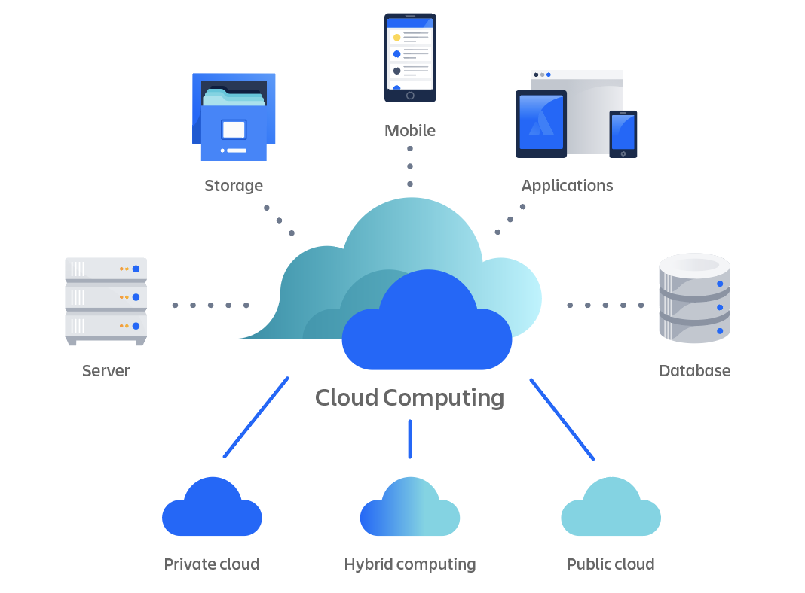
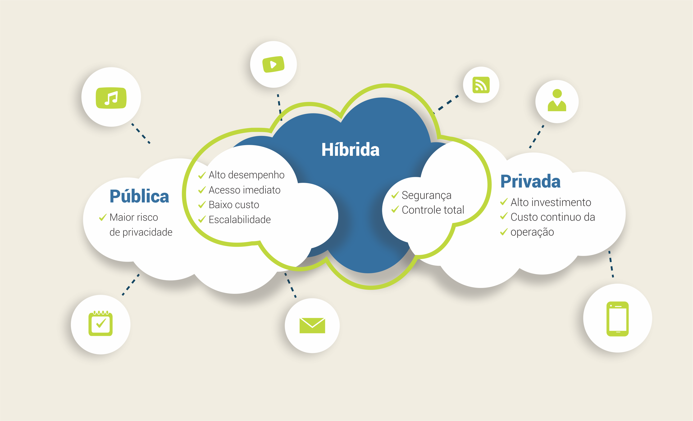

## Objetivos da aula

- Entender **o que é** computação em nuvem e como ela funciona
- Conhecer a **evolução histórica** que levou até a nuvem
- Diferenciar os modelos de implantação: **pública, privada e híbrida**
- Discutir **vantagens e desafios** de usar nuvem
- Conhecer os principais mecanismos de **segurança na nuvem**
- Ter uma visão do **futuro** da computação em nuvem

::: {.notes}
Abrir perguntando: "quem aqui já usou Google Drive, Netflix ou WhatsApp hoje?" — todos usaram computação em nuvem sem perceber. Isso ancora a aula.
:::

---

## O que é computação em nuvem?

> Entrega de recursos de TI (servidores, armazenamento, banco de dados, rede, software) **pela internet**, sob demanda, geralmente com pagamento conforme o uso.

- Em vez de comprar e manter seus próprios servidores...
- ...você **aluga capacidade computacional** de um provedor (AWS, Azure, Google Cloud etc.)

## Como ela funciona? (infraestrutura)

- Por trás da nuvem existe uma **rede global de data centers** com milhares de servidores físicos
- A **virtualização** é a tecnologia habilitadora: permite dividir um servidor físico em várias "máquinas" lógicas independentes

::: {.callout-note}
**Vamos aprofundar virtualização daqui a algumas aulas** — hoje o foco é entender o conceito de nuvem em si.
:::

## Como ela funciona? (para o usuário)

- O usuário nunca vê o hardware — só consome o recurso final (uma VM, um banco de dados, um site no ar)
- Tudo o que acontece "por baixo dos panos" (servidor físico, refrigeração, rede) é responsabilidade do provedor

## Computação em nuvem, visualmente

{fig-align="center" width="70%"}

---

## Linha do tempo: dos mainframes ao x86

::: {.incremental}
- **Anos 1960–70** — Mainframes: um computador gigante, vários terminais "burros" compartilhando o mesmo processamento
- **Anos 1980–90** — Computação pessoal e distribuída: cada um com seu próprio PC, poder de processamento descentralizado
- **1999** — VMware lança software de virtualização comercial para x86
:::

## Linha do tempo: a era da nuvem comercial

::: {.incremental}
- **2006** — Amazon lança o **AWS (EC2/S3)**, marco comercial da computação em nuvem moderna
- **2010s em diante** — Azure, Google Cloud, containers, nuvem vira padrão de mercado
:::

## Discussão rápida {background-color="#eaf5ec"}

**Você já usa computação em nuvem sem saber?**

- Google Drive / OneDrive
- Netflix / Spotify
- WhatsApp (backup na nuvem)
- Jogos salvos na nuvem (Steam Cloud, Google Play Games)

::: {.fragment}
Em duplas: listem **3 exemplos** de serviços em nuvem que vocês usam no dia a dia. (2 min)
:::

---

## Modelos de implantação (deployment)

Onde a infraestrutura de nuvem "mora" e quem tem acesso a ela.

## Nuvem pública

- Infraestrutura pertence a um **provedor terceirizado** (AWS, Azure, GCP...)
- Recursos compartilhados entre **múltiplos clientes** (multi-tenancy)

## Nuvem pública — vantagens e desvantagens

- **Vantagens:** custo baixo, escalabilidade praticamente ilimitada, sem manutenção própria
- **Desvantagens:** menos controle, dependência do provedor

## Nuvem privada

- Infraestrutura dedicada a **uma única organização**
- Pode estar no próprio data center da empresa ou hospedada por terceiros, mas de uso exclusivo

## Nuvem privada — vantagens e desvantagens

- **Vantagens:** mais controle, segurança e customização
- **Desvantagens:** custo mais alto, exige equipe própria de TI

## Nuvem híbrida

- Combina nuvem **pública + privada**, integradas
- Ex.: dados sensíveis ficam na nuvem privada; picos de demanda "estouram" para a nuvem pública

## Nuvem híbrida — vantagens e desvantagens

- **Vantagens:** flexibilidade, otimização de custo e segurança
- **Desvantagens:** complexidade de integração e gestão

## Pública, privada e híbrida — visualizando

{fig-align="center" width="65%"}

## Comparativo

| | Pública | Privada | Híbrida |
|---|---|---|---|
| Custo inicial | Baixo | Alto | Médio |
| Controle | Baixo | Alto | Médio |
| Escalabilidade | Muito alta | Limitada | Alta |
| Uso típico | Startups, apps web | Bancos, governo, saúde | Empresas em transição |

---

## Vantagens da nuvem (parte 1)

::: {.incremental}
- **Escalabilidade** — aumentar ou reduzir recursos sob demanda
- **Custo-benefício** — paga-se pelo uso (OPEX em vez de CAPEX)
- **Acessibilidade** — acesso de qualquer lugar, qualquer dispositivo
:::

## Vantagens da nuvem (parte 2)

::: {.incremental}
- **Backup e recuperação** — redundância facilita recuperação de desastres
- **Inovação e agilidade** — testar novas ideias sem investir em hardware
:::

## Desafios da nuvem (parte 1)

::: {.incremental}
- **Segurança e privacidade** — dados fora do seu controle físico
- **Dependência de conectividade** — sem internet, sem acesso
:::

## Desafios da nuvem (parte 2)

::: {.incremental}
- **Controle e gestão** — menos visibilidade sobre a infraestrutura real
- **Custos escaláveis** — uso mal gerenciado pode sair caro ("bill shock")
:::

---

## Segurança na nuvem

Compartilhar infraestrutura com outras empresas exige mecanismos de segurança específicos.

- **Multi-tenancy** — vários clientes compartilham a mesma infraestrutura física, isolados logicamente uns dos outros

## Criptografia

Dados protegidos tanto **em repouso** (armazenados) quanto **em trânsito** (trafegando pela rede).

## IAM (Identity and Access Management)

Controla **quem pode acessar o quê**, com que permissões — a base de qualquer política de segurança em nuvem.

## DLP (Data Loss Prevention)

Detecta e bloqueia **vazamento de dados sensíveis**, antes que saiam da organização.

## SIEM (Security Information and Event Management)

Centraliza e correlaciona **logs de segurança** de toda a infraestrutura para detectar ataques em andamento.

## ZTNA (Zero Trust Network Access)

"**Nunca confie, sempre verifique**": nenhum acesso é automaticamente confiável, mesmo vindo de dentro da rede.

## FWaaS (Firewall as a Service)

Firewall entregue **como serviço gerenciado** na nuvem, sem precisar de hardware próprio.

## CASB (Cloud Access Security Broker)

Camada de segurança entre usuários e provedores de nuvem, **aplicando as políticas da empresa**.

::: {.notes}
Não é preciso decorar as siglas — o importante é o aluno perceber que "segurança na nuvem" é uma área extensa e especializada, não só "colocar uma senha forte".
:::

---

## O futuro da nuvem: computação quântica

Provedores já oferecem **acesso a computadores quânticos como serviço** (ex.: AWS Braket, Azure Quantum), sem precisar ter o hardware.

## O futuro da nuvem: edge computing e IoT

Processamento acontece **mais perto de onde o dado é gerado** (sensores, dispositivos), reduzindo latência, em vez de mandar tudo para um data center distante.

## O futuro da nuvem: SASE

**SASE (Secure Access Service Edge)** converge rede e segurança em um único serviço entregue pela nuvem.

## O futuro da nuvem: nuvem verde

Sustentabilidade também é tendência — veremos em detalhe na **Aula 03**.

---

## E como a nuvem é "vendida"? {background-color="#fff8e1"}

Prévia da próxima aula: os **modelos de serviço**

- **IaaS** — infraestrutura (servidores, storage, rede virtuais)

## PaaS (prévia)

- **PaaS** — plataforma (ambiente pronto para desenvolver aplicações)

## SaaS (prévia)

- **SaaS** — software (aplicação pronta, só usar)

::: {.notes}
Não desenvolver aqui — é só o gancho para a Aula 02, que trata IaaS/PaaS/SaaS e o modelo de referência NIST formalmente.
:::

---

## Atividade da aula

::: {.callout-lab}
**Em duplas (10 min):**

1. Escolham 1 serviço de nuvem que vocês usam (ex.: Google Drive, Netflix, Discord)
2. Classifiquem: é nuvem pública, privada ou híbrida? Justifiquem.
3. Apontem 1 vantagem e 1 desafio real que vocês já perceberam usando esse serviço
:::

## Síntese da aula

- Computação em nuvem = **TI sob demanda, pela internet**, habilitada por virtualização
- Evoluiu de mainframes → PCs distribuídos → nuvem (AWS 2006 em diante)
- 3 modelos de implantação: **pública, privada, híbrida**
- Vantagens (escala, custo, acesso) vêm com desafios (segurança, dependência, controle)
- Segurança na nuvem envolve mecanismos específicos: **IAM, criptografia, DLP, SIEM, ZTNA, FWaaS, CASB**
- Tendências futuras: **computação quântica, edge computing, SASE, nuvem verde**

## Próxima aula

**Modelos de Serviço em Nuvem** — IaaS, PaaS, SaaS e a Arquitetura de Referência NIST

---

## Referências

- CHEE, B.; FRANKLIN, C. *Computação em Nuvem: cloud computing — tecnologias e estratégias*. M Books, 2013.
- NIST — *The NIST Definition of Cloud Computing* (SP 800-145)
