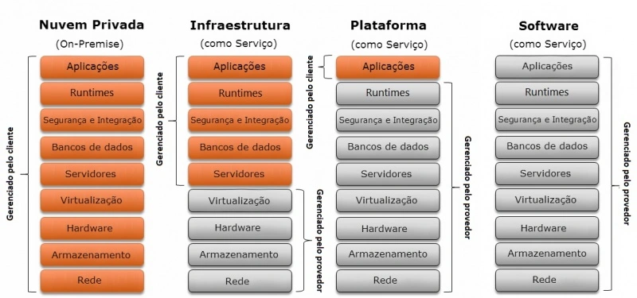

## Introdução

- Serviços:
  - Google Drive,
  - Dropbox,
  - iCloud,
  - AWS,
  - Microsoft Azure.
- A computação em nuvem se tornou uma parte essencial da infraestrutura de TI das empresas e usuários individuais.

## Introdução - Definição {.smaller}

- Computação em nuvem (Cloud Computing):
  - Em termos simples, ela se refere à entrega de recursos de TI pela internet.
    - Armazenamento de dados, servidores, redes e até softwares.
  - Ou seja, ao invés de armazenar arquivos em um computador físico ou em um servidor local, eles serão armazenados em servidores remotos, ou na "nuvem".
  - A nuvem permite que você acesse informações e recursos de qualquer lugar, desde que tenha uma conexão com a internet.
  - Principal característica:
    - Capacidade de aumentar ou diminuir recursos de acordo com a demanda.

## Introdução - Definição

- A computação em nuvem revolucionou a forma como empresas e indivíduos interagem com a tecnologia.
  - oferecendo uma plataforma flexível, escalável e econômica para uma ampla gama de aplicações.
- A nuvem permite acesso on-demand a recursos de computação, sem a necessidade de investir em infraestrutura física.

## Introdução - Definição {.smaller}

- O que é computação em nuvem?
  - Nuvem:
    - A "nuvem" é uma coleção sob demanda de servidores, armazenamento, aplicativos e outras infraestruturas de computação,
    - eles residem em data centers em todo o mundo e podem ser acessados pela Internet.
  - Termo completo:
    - É a capacidade de adquirir e usar serviços de computação pela Internet.
    - Fornece recursos de computação sob demanda,
    - A computação em nuvem evita a necessidade de instalação de servidores físicos, execução de software e gerenciamento de bancos de dados.
- A nuvem oferece inovação mais rápida, recursos flexíveis e economias de escala.

## Introdução - Como funciona? {.smaller}

- A nuvem é uma vasta rede de servidores de computador localizados em todo o mundo, juntamente com os dados, conteúdo, aplicativos, bancos de dados e outros recursos de computação.
- A computação em nuvem é possível graças à virtualização,
  - uma tecnologia que permite que um servidor físico execute vários computadores "virtuais".
  - Ela possibilita agrupar os recursos de muitos servidores físicos diferentes e disponibilizá-los para clientes ou usuários como um serviço único e altamente escalável.

## Introdução - Como funciona?

- A computação em nuvem reduz o custo de gerenciamento e acesso a recursos de computação.
  - Tornando o uso de hardware físico mais eficiente e permitindo que uma máquina física atenda a muitas necessidades e organizações diferentes.

## Introdução - Definição

{fig-align="center" width="70%"}

---

## Evolução - Introdução

- Computação Centralizada (Mainframe):
  - Todos os dados e recursos eram armazenados em mainframes.
  - A computação foi se distribuindo, e começaram a surgir redes de computadores que permitiram uma abordagem mais flexível e descentralizada.
- Computação Distribuída:
  - Método de fazer vários computadores trabalharem juntos,
  - Acarretou no surgimento da "nuvem".

## Evolução - Introdução

- O Surgimento da Nuvem:
  - O surgimento de empresas como Amazon Web Services (AWS), a computação em nuvem passou a ser popularizada.
  - Hoje: existem gigantes como Google Cloud, Microsoft Azure e muitos outros que oferecem uma gama enorme de serviços baseados em nuvem.

## Evolução - Computação Centralizada

- É um modelo de processamento de dados em que todas as tarefas são realizadas por um único computador central.
- Os usuários acessam o computador central por meio de terminais ou dispositivos com capacidades de processamento limitadas.
- O servidor central é responsável por processar, armazenar e gerenciar os dados.
- Todos os usuários de um sistema centralizado dependem de uma única fonte de serviço.

## Evolução - Computação Distribuída

- Envolve a cooperação de duas ou mais máquinas se comunicando em uma rede.
- As máquinas que participam do sistema podem variar de computadores pessoais a supercomputadores;
- a rede pode conectar máquinas em um edifício ou em continentes diferentes.

---

## Modelos de Implantação

- Nem todas as nuvens são iguais e nenhum tipo de computação em nuvem é adequado para todos.
- Vários modelos, tipos e serviços diferentes evoluíram para ajudar a oferecer a solução certa para determinadas necessidades.
- Abaixo as três principais maneiras de implantar serviços em nuvem:
  - Nuvem pública,
  - Nuvem privada,
  - Nuvem híbrida.

## Modelos de Implantação - Nuvem Pública

- As nuvens públicas são de propriedade e operadas por provedores de serviços de nuvem terceirizados, que fornecem recursos de computação como servidores e armazenamento pela Internet.
- A Google Cloud (GCP), Azure da Microsoft e a AWS da Amazon são exemplos de nuvens públicas, líderes de mercado nesse segmento.
- Com uma nuvem pública, todo o hardware, software e outras infraestruturas de suporte são gerenciados pelo provedor de nuvem.
- Você pode acessar esses serviços e gerenciar sua conta usando um navegador da Web, API ou CLI.

## Modelos de Implantação - Nuvem Pública

- Definição: A infraestrutura é de propriedade de um provedor de serviços de nuvem e é compartilhada entre vários clientes.
- Exemplos: Amazon Web Services (AWS), Microsoft Azure, Google Cloud.
- Vantagens: Menor custo, escalabilidade, flexibilidade.
- Desvantagens: Menor controle sobre os dados e a segurança, dependência de um fornecedor externo.

## Modelos de Implantação - Nuvem Privada

- Uma nuvem privada refere-se a recursos de computação em nuvem usados exclusivamente por uma única empresa ou organização.
- Uma nuvem privada pode estar fisicamente localizada no data center local da empresa.
- Algumas empresas também pagam provedores de serviços terceirizados para hospedar sua nuvem privada.
- Um ambiente de nuvem privada mantém os serviços e a infraestrutura em uma rede privada.

## Modelos de Implantação - Nuvem Privada

- Definição: A infraestrutura de nuvem é dedicada exclusivamente a uma única organização.
- Exemplos: Data centers privados, soluções como VMware ou OpenStack.
- Vantagens: Maior controle, segurança aprimorada, personalização.
- Desvantagens: Maior custo inicial, manutenção complexa, escalabilidade limitada.

## Modelos de Implantação - Nuvem Híbrida

- A nuvem híbrida oferece uma combinação de nuvens públicas e privadas, conectadas em rede de forma que dados e aplicativos possam ser compartilhados entre elas.
- As nuvens híbridas oferecem às empresas maior flexibilidade para dimensionamento e implantação.

## Modelos de Implantação - Nuvem Híbrida

- Definição: Combinação de nuvem pública e privada, permitindo que os dados e aplicações sejam compartilhados entre elas.
- Exemplos: Empresas que mantêm dados sensíveis em uma nuvem privada, mas utilizam a nuvem pública para outras operações.
- Vantagens: Flexibilidade, escalabilidade, controle de dados sensíveis.
- Desvantagens: Complexidade na gestão, custos mais elevados.

## Modelos de Implantação

{fig-align="center" width="65%"}

---

## Computação em Nuvem - Vantagens

- **Escalabilidade**: A capacidade de aumentar ou reduzir os recursos conforme a demanda, o que é ideal para empresas de diferentes tamanhos.
- **Custo-benefício**: Redução de custos com infraestrutura, hardware, e manutenção, já que o provedor de nuvem gerencia a maior parte.
- **Acessibilidade**: A nuvem permite o acesso remoto e de qualquer lugar, facilitando o trabalho remoto e a colaboração entre equipes geograficamente distantes.

## Computação em Nuvem - Vantagens

- **Backup e Recuperação**: Facilita a criação de backups automáticos e a recuperação rápida de dados em caso de falhas.
- **Inovação e Agilidade**: Novas ferramentas e atualizações são disponibilizadas de forma mais rápida e eficiente, permitindo inovação contínua.

## Computação em Nuvem - Desafios

- **Segurança e Privacidade**: O armazenamento de dados sensíveis em servidores de terceiros pode representar riscos em termos de privacidade e segurança.
- **Dependência de Conectividade**: A computação em nuvem depende de uma conexão com a internet; a indisponibilidade da rede pode afetar a operação.
- **Controle e Gestão**: Embora a nuvem ofereça muitos recursos, o controle sobre os dados e a infraestrutura pode ser limitado em comparação a uma solução local.
- **Custos Escaláveis**: Apesar de os custos iniciais serem baixos, o uso contínuo de recursos pode resultar em gastos crescentes.

## Computação em Nuvem - Serviços {.smaller}

- A maioria dos serviços de computação em nuvem se enquadra em quatro grandes categorias:
  - Infraestrutura como serviço (IaaS),
  - Plataforma como serviço (PaaS),
  - Software como serviço (SaaS),
  - Sem servidor (Serverless computing).
- Às vezes, eles são chamados de "pilha de computação em nuvem" porque são construídos uns sobre os outros.
- Saber o que são e como são diferentes facilita a realização de seus objetivos de negócios.

## Computação em Nuvem - IaaS {.smaller}

- Infraestrutura como serviço (IaaS):
  - Esta é a categoria mais básica de serviços de computação em nuvem.
  - Com a IaaS, você aluga infraestrutura de TI de um provedor de nuvem com pagamento conforme o uso:
    - servidores e máquinas virtuais,
    - armazenamento,
    - rede,
    - sistemas operacionais.

## Computação em Nuvem - PaaS {.smaller}

- Plataforma como serviço (PaaS):
  - Refere-se a serviços de computação em nuvem que fornecem um ambiente sob demanda para desenvolver, testar, entregar e gerenciar aplicativos de software.
  - O PaaS torna mais fácil para os desenvolvedores criar rapidamente aplicativos Web ou aplicativos móveis sem se preocupar em configurar ou gerenciar a infraestrutura subjacente de servidores, armazenamento, rede e bancos de dados.

## Computação em Nuvem - SaaS {.smaller}

- Software como serviço (SaaS):
  - É um método para fornecer aplicativos de software pela Internet, sob demanda e, normalmente, por assinatura.
  - Com o SaaS, os provedores de nuvem hospedam e gerenciam o software e a infraestrutura subjacente e lidam com qualquer manutenção, como atualizações de software e patches de segurança.
  - Os usuários se conectam ao aplicativo pela Internet, geralmente com um navegador da Web em seu telefone, tablet ou PC.

## Computação em Nuvem - Serverless computing {.smaller}

- Computação sem servidor (Serverless computing):
  - Sobrepondo-se ao PaaS, a computação sem servidor se concentra na criação de funcionalidades de aplicativos sem gastar tempo gerenciando continuamente os servidores e a infraestrutura necessários para isso.
  - O provedor de nuvem lida com a configuração, o planejamento de capacidade e o gerenciamento do servidor para você.
  - As arquiteturas sem servidor são altamente escaláveis e orientadas a eventos, usando recursos apenas quando ocorre uma função ou gatilho específico.

## Computação em Nuvem - Serviços

{fig-align="center" width="80%"}

## Computação em Nuvem - Segurança {.smaller}

- A segurança na nuvem é uma grande preocupação para muitas empresas que armazenam dados e executam aplicativos na nuvem.
- Muitas ofertas de nuvem pública são ambientes multi-locatários
  - Significa que os dados de vários clientes ficam no mesmo servidor, aumentando a possibilidade de violação.
- Sabendo que muitas organizações armazenam dados confidenciais na nuvem, os cibercriminosos têm maior incentivo para tentar violar as defesas dos provedores de serviços em nuvem para que possam acessar ou roubar informações valiosas.

## Computação em Nuvem - Segurança {.smaller}

- A segurança já foi o principal obstáculo para as empresas que consideram mover dados e recursos para a nuvem.
- Hoje, a maioria dos provedores de serviços em nuvem investiram em medidas de segurança que oferecem maior proteção do que os data centers locais podem gerenciar.
- Como os provedores de nuvem investem mais pesadamente em soluções de segurança, muitas empresas descobriram que a nuvem pode oferecer melhor segurança do que seus próprios ambientes de TI locais.

## Computação em Nuvem - Segurança {.smaller}

- Para fortalecer a segurança na nuvem, as organizações podem adotar várias práticas recomendadas e tecnologias para garantir que seus dados permaneçam protegidos contra roubo, perda e inacessibilidade devido a interrupções.
  - A criptografia de dados fornece proteção mais forte para dados em repouso, em trânsito e em uso.
  - As soluções de gerenciamento de identidade e acesso do usuário garantem que apenas usuários autorizados possam acessar dados e recursos na nuvem.
  - A tecnologia de monitoramento de segurança e conformidade fornece alerta antecipado de possíveis violações, garantindo que as medidas de segurança estejam em conformidade com as estruturas regulatórias.

## Computação em Nuvem - Segurança - Soluções {.smaller}

- A proteção de ativos na nuvem requer uma abordagem em várias camadas para se defender contra uma ampla gama de ameaças.
- As soluções de segurança baseadas em nuvem mais comuns incluem:
  - Gerenciamento de identidade e acesso:
    - Controles fortes de identidade e acesso ajudam a impedir o acesso não autorizado a dados confidenciais.
    - As soluções de autenticação multifator dificultam o uso de credenciais roubadas por agentes mal-intencionados para acessar ativos de nuvem.

## Computação em Nuvem - Segurança - Soluções {.smaller}

- As soluções de segurança baseadas em nuvem mais comuns incluem:
  - Prevenção contra perda de dados (DLP):
    - As soluções DLP inspecionam o tráfego de saída para evitar vazamentos inadvertidos ou maliciosos de dados confidenciais, como informações de cartão de crédito, dados financeiros, propriedade intelectual e outras informações valiosas.
  - Monitoramento contínuo:
    - As soluções de segurança que permitem que as equipes de TI monitorem continuamente as plataformas e os serviços em nuvem podem ajudar a identificar e corrigir rapidamente possíveis ameaças.

## Computação em Nuvem - Segurança - Soluções {.smaller}

- As soluções de segurança baseadas em nuvem mais comuns incluem:
  - Gerenciamento de eventos e informações de segurança (SIEM):
    - As soluções SIEM oferecem monitoramento e análise em tempo real de eventos de segurança e rastreamento e registro de dados de segurança que suportam auditorias de segurança e esforços de conformidade.
  - Segurança de rede em nuvem:
    - Ao monitorar o tráfego de rede, as soluções de segurança de rede em nuvem podem impedir que ameaças entrem na rede e corrigir rapidamente as ameaças que violaram as defesas com sucesso antes que possam se mover lateralmente para acessar alvos de alto valor.

## Computação em Nuvem - Segurança - Soluções {.smaller}

- As soluções de segurança baseadas em nuvem mais comuns incluem:
  - Acesso à rede Zero Trust (ZTNA):
    - A tecnologia ZTNA exige que usuários e aplicativos sejam autenticados em cada solicitação de acesso a ativos em nuvem, ajudando a evitar violações de dados com mais sucesso.
  - Firewall como serviço (FWaaS):
    - Uma solução FWaaS substitui os dispositivos de firewall físico por soluções baseadas em nuvem que oferecem recursos avançados de firewall, incluindo filtragem de URL, prevenção avançada de ameaças, prevenção de intrusão, controles de acesso e segurança de DNS.

## Computação em Nuvem - Segurança - Soluções {.smaller}

- As soluções de segurança baseadas em nuvem mais comuns incluem:
  - Proteção de dados:
    - Ao criptografar dados em trânsito e em repouso, as equipes de TI podem proteger melhor os dados na nuvem e garantir a conformidade com uma ampla gama de estruturas regulatórias.
  - Inteligência de ameaças:
    - A inteligência de ameaças mais recente pode ajudar as organizações a identificar e se defender contra ameaças cibernéticas emergentes.

## Computação em Nuvem - Segurança - Soluções {.smaller}

- As soluções de segurança baseadas em nuvem mais comuns incluem:
  - Agentes de segurança de acesso à nuvem (CASBs):
    - Um CASB fica entre os clientes e seus serviços em nuvem para ajudar a aplicar políticas de segurança e adicionar uma camada de segurança.

## Computação em Nuvem - Futuro {.smaller}

- A nuvem está em constante evolução e há várias tendências que os especialistas preveem que dominarão a computação em nuvem nos próximos anos.
- A nuvem permitirá a computação quântica que pode processar cálculos complexos e conjuntos de dados massivos mais rapidamente.
- Com o crescimento dos dispositivos da Internet das Coisas (IoT) e outros aplicativos sensíveis à latência, os provedores de nuvem provavelmente adotarão a computação de borda,
  - permitindo que os sistemas sejam mais distribuídos e aproximem os dados e o processamento dos usuários.

## Computação em Nuvem - Futuro {.smaller}

- A borda de serviço de acesso seguro (SASE) desempenhará um papel importante no gerenciamento de segurança e risco.
- As iniciativas de "nuvem verde" trabalharão para reduzir a enorme quantidade de energia que a nuvem requer para eletricidade e resfriamento, melhorando a reciclagem de hardware e reduzindo o lixo eletrônico.

---

## Obrigado!

::: {.notes}
Fim da Aula 01 — conteúdo fiel ao material de referência do professor anterior (PDF de 41 slides), com autoria atualizada.
:::
