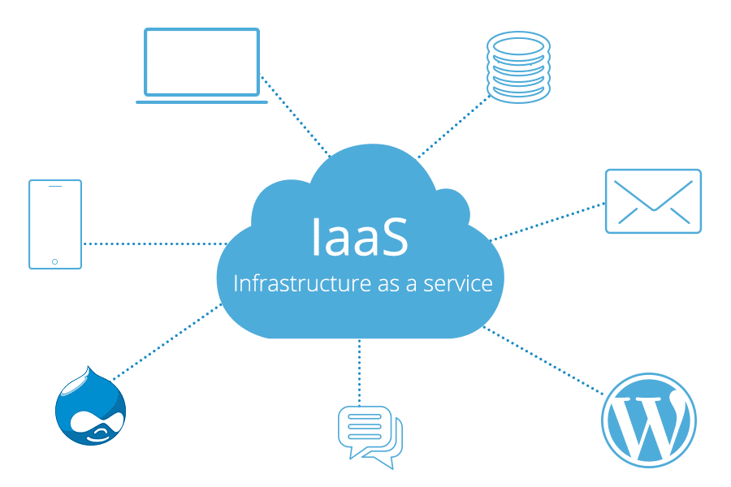
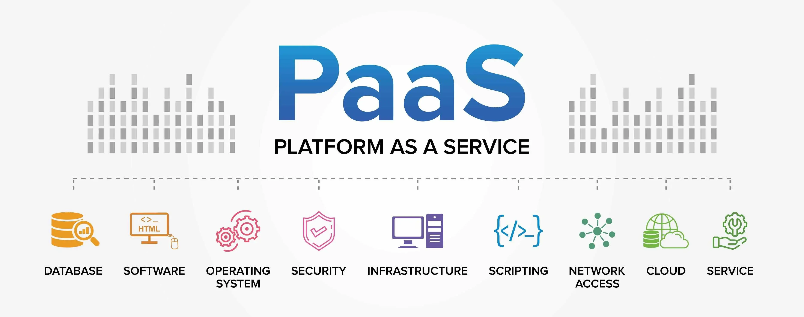
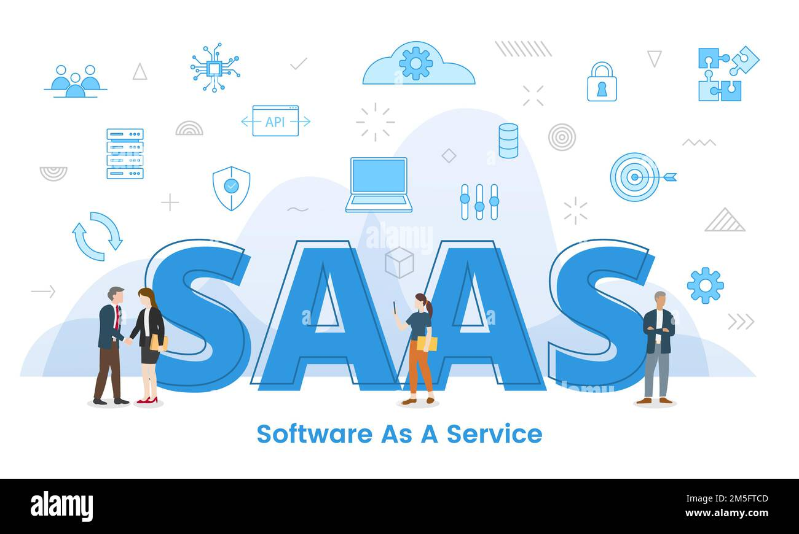
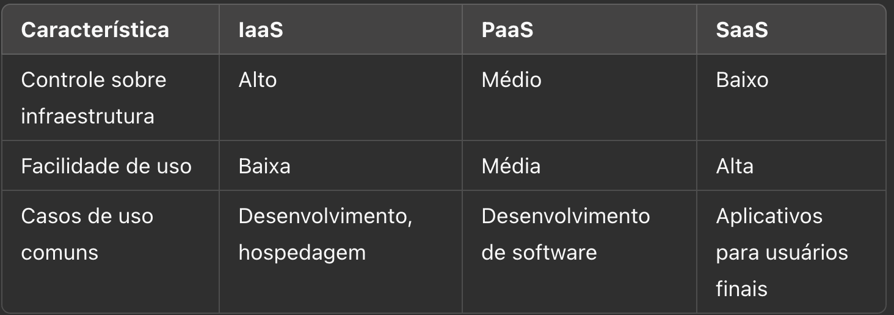
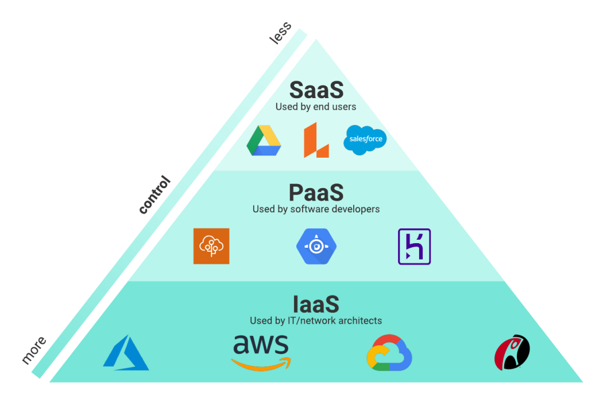
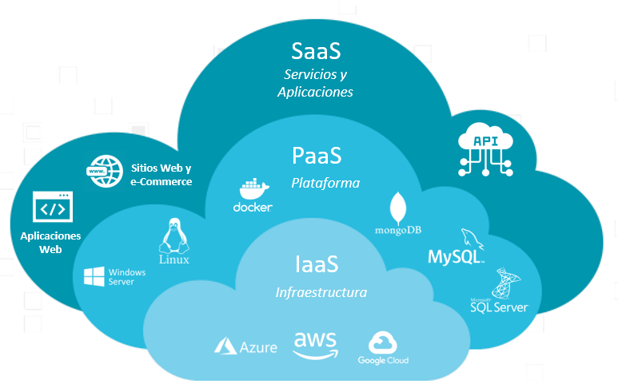

## Introdução

- A computação em nuvem revolucionou a forma como empresas e indivíduos utilizam a tecnologia.
- Os modelos de serviço em nuvem são categorizações que definem como os recursos de computação são fornecidos e gerenciados na nuvem.
- Eles são classificados em três principais tipos:
  - IaaS (Infrastructure as a Service),
  - PaaS (Platform as a Service) e
  - SaaS (Software as a Service).
- Cada um desses modelos oferece diferentes níveis de controle, flexibilidade e gerenciamento para os usuários.

## IaaS - Introdução

- Infrastructure as a Service (IaaS) é um modelo de computação em nuvem que fornece infraestrutura de TI virtualizada por meio da internet.
- Esse modelo permite que empresas e desenvolvedores acessem recursos como:
  - servidores,
  - armazenamento,
  - redes e
  - sistemas operacionais sob demanda.
- A IaaS permite utilização destes recursos sem a necessidade de investir em hardware físico.

## IaaS - Introdução

- No modelo IaaS, a infraestrutura de TI é fornecida como um serviço.
- Isso inclui servidores, armazenamento, redes e virtualização.
- As empresas podem alocar e gerenciar esses recursos conforme a demanda, sem a necessidade de investir em hardware físico.
- Exemplos de provedores de IaaS incluem Amazon Web Services (AWS), Microsoft Azure e Google Cloud Platform (GCP).

## IaaS - Introdução {.smaller}

{fig-align="center" width="55%"}

## IaaS - Características {.smaller}

- O IaaS se diferencia por diversas características essenciais:
  - Escalabilidade:
    - Os recursos podem ser ajustados conforme a demanda, garantindo eficiência operacional e redução de custos.
  - Pay-as-you-go:
    - O modelo de pagamento é baseado no uso, permitindo que as empresas paguem apenas pelos recursos consumidos.
  - Gerenciamento Automatizado:
    - Muitos provedores oferecem ferramentas para automação e orquestração, facilitando a administração da infraestrutura.

## IaaS - Características

- O IaaS se diferencia por diversas características essenciais:
  - Acesso Remoto:
    - Todos os recursos podem ser acessados via internet, permitindo maior flexibilidade para as equipes de TI.
  - Segurança:
    - Os provedores de IaaS investem em segurança robusta, oferecendo criptografia de dados, firewalls e controle de acesso.

## IaaS - Provedores {.smaller}

- Atualmente, várias empresas oferecem serviços de IaaS, incluindo:
  - Amazon Web Services (AWS) EC2:
    - Oferece servidores virtuais sob demanda, permitindo que empresas escalem suas aplicações com facilidade.
  - Microsoft Azure Virtual Machines:
    - Proporciona máquinas virtuais com diversas configurações para atender a diferentes necessidades de negócios.
  - Google Cloud Compute Engine:
    - Serviço de máquinas virtuais altamente configuráveis para cargas de trabalho variadas.
  - IBM Cloud Infrastructure:
    - Fornece servidores bare metal e virtuais para aplicações empresariais exigentes.

## IaaS - Aplicações {.smaller}

- O IaaS é amplamente utilizado em diversos setores e cenários:
  - Hospedagem de Aplicações e Websites:
    - Empresas podem utilizar servidores virtuais para hospedar aplicações sem a necessidade de manter servidores físicos.
  - Análise de Dados e Big Data:
    - O processamento de grandes volumes de dados é facilitado pela infraestrutura escalável do IaaS.
  - Desenvolvimento e Testes:
    - Ambientes de desenvolvimento podem ser criados rapidamente e descartados após o uso.

## IaaS - Aplicações {.smaller}

- O IaaS é amplamente utilizado em diversos setores e cenários:
  - Backup e Recuperação de Desastres:
    - A infraestrutura em nuvem garante a continuidade dos negócios em caso de falhas.
  - Computação de Alto Desempenho:
    - Aplicações que exigem grande capacidade de processamento, como inteligência artificial e modelagem científica, podem ser executadas em ambientes IaaS.

## IaaS - Vantagens {.smaller}

- Entre os principais benefícios do IaaS, destacam-se:
  - Redução de Custos:
    - Não há necessidade de investir em hardware físico.
  - Agilidade e Flexibilidade:
    - Implantação rápida de novos serviços e ajustes dinâmicos na infraestrutura.
  - Alta Disponibilidade:
    - Infraestrutura robusta e redundante para garantir a continuidade das operações.
  - Foco no Core Business:
    - Empresas podem se concentrar no desenvolvimento de produtos e serviços sem se preocupar com a gestão de infraestrutura.

## IaaS - Desafios e Considerações {.smaller}

- Apesar dos inúmeros benefícios, o uso de IaaS apresenta desafios como:
  - Gerenciamento de Custos:
    - Sem monitoramento adequado, os custos podem aumentar rapidamente.
  - Dependência do Provedor:
    - A empresa pode ficar dependente da infraestrutura e das políticas do provedor escolhido.
  - Segurança e Conformidade:
    - Garantir a proteção dos dados e atender a regulamentações pode ser um desafio para algumas organizações.

---

## PaaS - Introdução

- Platform as a Service (PaaS) é um modelo de computação em nuvem que fornece uma plataforma completa para desenvolvimento, execução e gerenciamento de aplicações.
- Diferente do Infrastructure as a Service (IaaS), que oferece apenas infraestrutura, o PaaS inclui ferramentas de desenvolvimento, sistemas operacionais, banco de dados e outros serviços.
- PaaS oferece todo tipo de serviços necessários para criar e implantar softwares sem se preocupar com a administração de hardware e redes.

## PaaS - Introdução

- O PaaS oferece uma plataforma completa para o desenvolvimento, execução e gerenciamento de aplicações.
- Ele inclui sistemas operacionais, bancos de dados, servidores web e ferramentas de desenvolvimento.
- Esse modelo permite que os desenvolvedores se concentrem na criação de software sem se preocupar com a infraestrutura subjacente.
- Exemplos de PaaS incluem Google App Engine, Microsoft Azure App Services e Heroku.

## PaaS - Introdução

{fig-align="center" width="65%"}

## PaaS - Características {.smaller}

- O PaaS apresenta diversas características que o tornam uma solução eficiente para desenvolvedores e empresas:
  - Ambiente de Desenvolvimento Integrado (IDE):
    - Plataformas PaaS oferecem ambientes de programação prontos para uso.
  - Gerenciamento Automatizado:
    - Atualizações, segurança e escalabilidade são gerenciados pelo provedor.
  - Escalabilidade:
    - Suporte a crescimento de aplicações conforme a demanda.

## PaaS - Características

- O PaaS apresenta diversas características que o tornam uma solução eficiente para desenvolvedores e empresas:
  - Multiplataforma:
    - Compatível com diferentes linguagens e frameworks de desenvolvimento.
  - Facilidade de Integração:
    - Possibilidade de conectar serviços como banco de dados, APIs e inteligência artificial.

## PaaS - Provedores {.smaller}

- Diversos provedores de nuvem oferecem soluções PaaS, incluindo:
  - Google App Engine:
    - Permite criar e hospedar aplicações sem necessidade de gerenciar infraestrutura.
  - Microsoft Azure App Services:
    - Oferece suporte para desenvolvimento de aplicações web e móveis.
  - AWS Elastic Beanstalk:
    - Serviço que facilita a implantação e o gerenciamento de aplicações na AWS.
  - Heroku:
    - Plataforma baseada em contêineres para implantação e gerenciamento de aplicações na nuvem.

## PaaS - Aplicações {.smaller}

- O PaaS é utilizado em diversos cenários, incluindo:
  - Desenvolvimento Ágil:
    - Equipes podem criar e testar aplicações rapidamente sem configurar servidores.
  - Aplicações Web e Móveis:
    - Suporte à criação de aplicativos escaláveis e de alta disponibilidade.
  - Análise de Dados e Machine Learning:
    - Plataformas PaaS oferecem ferramentas para análise e inteligência artificial.

## PaaS - Aplicações

- O PaaS é utilizado em diversos cenários, incluindo:
  - Integração de APIs e Serviços:
    - Facilita a conexão entre diferentes sistemas e serviços.
  - Automação de Processos de Negócios:
    - Empresas utilizam PaaS para desenvolver aplicações que otimizam processos internos.

## PaaS - Vantagens {.smaller}

- As principais vantagens do PaaS incluem:
  - Redução de Custos:
    - Diminui a necessidade de infraestrutura e gerenciamento.
  - Rapidez no Desenvolvimento:
    - Acelera a criação de aplicações com ferramentas pré-configuradas.
  - Maior Foco no Produto:
    - Desenvolvedores podem se concentrar no código, sem se preocupar com infraestrutura.

## PaaS - Vantagens

- As principais vantagens do PaaS incluem:
  - Facilidade de Colaboração:
    - Equipes podem trabalhar simultaneamente no desenvolvimento de software.
  - Atualizações e Manutenção:
    - O provedor de PaaS gerencia atualizações e segurança.

## PaaS - Desafios e Considerações {.smaller}

- Apesar dos benefícios, o PaaS apresenta desafios como:
  - Dependência do Provedor:
    - Empresas podem ficar presas a um único fornecedor.
  - Limitações de Configuração:
    - Algumas plataformas podem ter restrições quanto a personalizações avançadas.
  - Segurança:
    - Garantir conformidade com regulamentações pode ser um desafio para algumas organizações.

---

## SaaS - Introdução

- Software as a Service (SaaS) é um modelo de computação em nuvem que fornece software sob demanda através da internet.
- Os usuários acessam aplicações sem a necessidade de instalar ou manter infraestrutura local, uma vez que todo o gerenciamento, manutenção e segurança ficam a cargo do provedor do serviço.
- O SaaS é amplamente adotado em diversos setores, facilitando o acesso a ferramentas essenciais para empresas e usuários finais.

## SaaS - Introdução {.smaller}

- No modelo SaaS, o software é entregue aos usuários finais como um serviço acessado pela internet.
- Os provedores de SaaS gerenciam toda a infraestrutura, manutenção e segurança, permitindo que os usuários utilizem as aplicações sem necessidade de instalação ou gerenciamento local.
- Exemplos de SaaS incluem Google Workspace, Microsoft 365, Dropbox e Salesforce.

## SaaS - Introdução

{fig-align="center" width="55%"}

## SaaS - Características {.smaller}

- O SaaS apresenta diversas características que o tornam um modelo eficiente para distribuição de software:
  - Acesso via Internet:
    - Os usuários acessam o software através de navegadores, eliminando a necessidade de instalação local.
  - Gerenciamento Centralizado:
    - As atualizações, patches de segurança e manutenções são realizadas pelo provedor.
  - Modelo de Assinatura:
    - Geralmente, os usuários pagam uma taxa mensal ou anual pelo uso do serviço.

## SaaS - Características

- O SaaS apresenta diversas características que o tornam um modelo eficiente para distribuição de software:
  - Escalabilidade:
    - Pode ser facilmente ajustado conforme a demanda da empresa.
  - Multiplataforma:
    - Compatível com diversos dispositivos e sistemas operacionais.

## SaaS - Provedores {.smaller}

- Muitas empresas oferecem soluções SaaS para diferentes necessidades, incluindo:
  - Google Workspace:
    - Ferramentas como Gmail, Google Drive e Google Docs permitem colaboração em tempo real.
  - Microsoft 365:
    - Conjunto de aplicativos como Word, Excel, Teams e Outlook baseados na nuvem.
  - Salesforce:
    - Plataforma de CRM (Customer Relationship Management) usada para gerenciar clientes e vendas.

## SaaS - Provedores

- Muitas empresas oferecem soluções SaaS para diferentes necessidades, incluindo:
  - Dropbox:
    - Serviço de armazenamento e compartilhamento de arquivos na nuvem.
  - Slack:
    - Ferramenta de comunicação e colaboração para equipes empresariais.

## SaaS - Aplicações {.smaller}

- O SaaS é amplamente utilizado em diferentes áreas, incluindo:
  - Gestão Empresarial:
    - Softwares de ERP e CRM ajudam empresas a gerenciar processos e clientes.
  - Colaboração e Comunicação:
    - Aplicações como Zoom e Microsoft Teams permitem reuniões e colaboração online.
  - E-commerce:
    - Plataformas como Shopify e Magento facilitam a criação de lojas virtuais.

## SaaS - Aplicações

- O SaaS é amplamente utilizado em diferentes áreas, incluindo:
  - Marketing Digital:
    - Ferramentas como HubSpot e Mailchimp ajudam na automação de campanhas de marketing.
  - Armazenamento e Backup:
    - Serviços como Google Drive e OneDrive permitem armazenar e compartilhar arquivos com segurança.

## SaaS - Vantagens {.smaller}

- Entre os principais benefícios do SaaS, destacam-se:
  - Redução de Custos:
    - Elimina a necessidade de comprar licenças e servidores.
  - Fácil Adoção:
    - Não exige instalação complexa, permitindo uso imediato.
  - Atualizações Automáticas:
    - O provedor garante que a versão mais recente do software esteja sempre disponível.

## SaaS - Vantagens

- Entre os principais benefícios do SaaS, destacam-se:
  - Acesso Remoto:
    - Usuários podem acessar o software de qualquer lugar, facilitando o trabalho remoto.
  - Segurança e Backup:
    - Dados são armazenados na nuvem com proteção e redundância.

## SaaS - Desafios e Considerações {.smaller}

- Apesar das vantagens, o SaaS também apresenta desafios:
  - Dependência de Internet:
    - O acesso ao software depende de uma conexão estável.
  - Risco de Privacidade:
    - Os dados são armazenados em servidores externos, exigindo atenção à segurança.
  - Customização Limitada:
    - Algumas plataformas podem não permitir personalizações avançadas.
  - Modelo de Assinatura:
    - O custo pode se tornar elevado a longo prazo dependendo do número de usuários.

---

## Modelos - Comparativo entre os Modelos

{fig-align="center" width="70%"}

## Modelos - Benefícios

- Os modelos de serviço em nuvem oferecem diversos benefícios:
  - escalabilidade,
  - redução de custos com infraestrutura,
  - acessibilidade remota,
  - segurança aprimorada e
  - atualizações automáticas.

## Modelos - Benefícios {.smaller}

- Cada organização pode escolher o modelo mais adequado conforme suas necessidades específicas, permitindo maior eficiência e inovação.
- Com a evolução das tecnologias em nuvem, surgem também modelos híbridos e novas abordagens, como:
  - FaaS (Function as a Service)
  - CaaS (Container as a Service)
- Estes outros modelos podem ampliar ainda mais as possibilidades e flexibilidade para empresas e desenvolvedores.

## Modelos

{fig-align="center" width="55%"}

## Modelos

{fig-align="center" width="50%"}

---

## Obrigado!

::: {.notes}
Fim da Aula 02 — conteúdo fiel ao material de referência do professor anterior (PDF de 41 slides), com autoria atualizada.
:::
