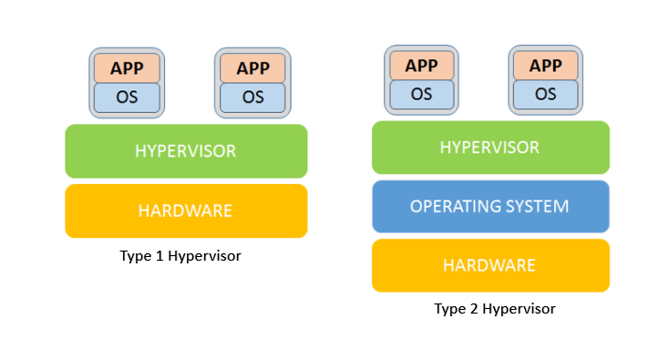
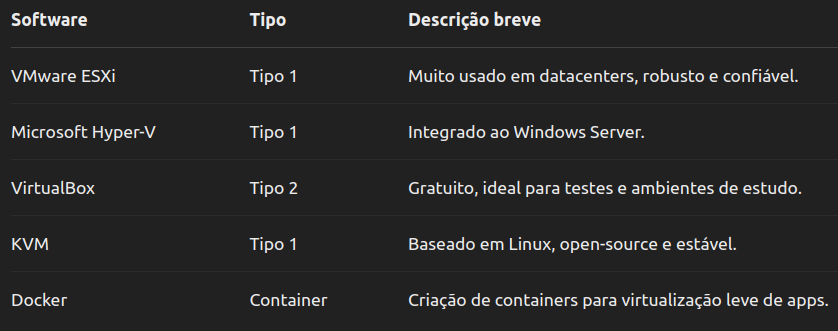

## Virtualização - Introdução

- Virtualização
  - É a técnica de criar uma versão virtual de algo, como hardware, sistema operacional, armazenamento ou recursos de rede.
  - Em vez de utilizar recursos físicos de forma direta e isolada, a virtualização permite que eles sejam particionados e gerenciados de forma mais eficiente, criando múltiplas instâncias virtuais que compartilham os mesmos recursos físicos.

## Virtualização - Introdução

- A base da virtualização está em um software chamado hipervisor (ou hypervisor, em inglês), que atua como uma camada intermediária entre o hardware físico e os sistemas operacionais.
- Este software gerencia os recursos da máquina física e os distribui entre as máquinas virtuais (VMs).
- Cada máquina virtual opera de forma independente, com seu próprio sistema operacional e aplicações, como se fosse um computador físico completo.

## Virtualização - Aplicações

- A virtualização é amplamente utilizada em ambientes corporativos, especialmente em data centers e infraestruturas de nuvem.
- Ela também é comum em ambientes de teste e desenvolvimento de software, onde é possível simular diferentes sistemas operacionais e configurações sem necessidade de múltiplas máquinas físicas.

## Virtualização - Tipos de hipervisores

- Existem dois tipos principais de hipervisores:
  - Tipo 1 (bare-metal):
    - Instalado diretamente no hardware físico, sem um sistema operacional intermediário. Exemplos: VMware ESXi, Microsoft Hyper-V.
  - Tipo 2 (hosted):
    - Instalado sobre um sistema operacional tradicional, como um aplicativo. Exemplos: VMware Workstation, Oracle VirtualBox.

## Virtualização - Vantagens

- Melhor aproveitamento dos recursos:
  - Um único servidor físico pode hospedar várias VMs, evitando desperdício de capacidade computacional.
- Redução de custos:
  - Menor necessidade de hardware físico, menor consumo de energia e espaço físico.
- Isolamento:
  - Problemas em uma máquina virtual não afetam as outras.

## Virtualização - Vantagens

- Escalabilidade e flexibilidade:
  - É possível criar, modificar ou excluir VMs conforme a demanda.
- Facilidade de gerenciamento e manutenção:
  - Backups, migrações e recuperação de falhas são mais simples e rápidos.

## Virtualização - Tipos de Virtualização

- Virtualização de Servidores
- Virtualização de Desktop
- Virtualização de Aplicações
- Virtualização de Armazenamento
- Virtualização de Rede
- Virtualização de Dados
- Virtualização de Hardware

## Virtualização - Virtualização de Servidores

- A virtualização de servidores é o tipo mais comum e amplamente utilizado.
- Ela permite que vários sistemas operacionais sejam executados em um único servidor físico, por meio de máquinas virtuais (VMs).
- Cada VM tem seu próprio sistema operacional, aplicativos e recursos isolados.

## Virtualização - Virtualização de Servidores

- Benefícios:
  - Redução de custos com hardware
  - Maior aproveitamento dos recursos do servidor
  - Facilidade na criação e replicação de ambientes
  - Isolamento entre sistemas
- Exemplos de uso: data centers, ambientes de testes, hospedagem de múltiplos sites ou serviços em um único servidor físico.

## Virtualização - Virtualização de Desktop

- O sistema operacional do usuário (geralmente Windows ou Linux) é executado em um servidor central,
- os usuários acessam esse ambiente remoto por meio de qualquer dispositivo (PC, tablet, thin client etc.).
- Benefícios:
  - Centralização da administração e segurança
  - Facilidade de backup e recuperação
  - Flexibilidade de acesso (trabalho remoto)
  - Redução de custos com manutenção de hardware
- Exemplos de uso: empresas com equipes remotas, escolas com laboratórios de informática, call centers.

## Virtualização - Virtualização de Aplicações

- Esse tipo de virtualização permite que um aplicativo seja executado em um ambiente virtualizado, sem estar diretamente instalado no sistema operacional do usuário.
- Ele é isolado do restante do sistema, o que reduz conflitos e facilita a distribuição.

## Virtualização - Virtualização de Aplicações

- Benefícios:
  - Evita conflitos entre aplicativos
  - Facilidade de atualização e manutenção
  - Compatibilidade com diferentes sistemas
  - Execução em dispositivos com recursos limitados
- Exemplos de uso: softwares legados que precisam rodar em novos sistemas, ambientes controlados para testes de aplicativos, soluções como Microsoft App-V ou Citrix Virtual Apps.

## Virtualização - Virtualização de Armazenamento

- A virtualização de armazenamento reúne diversos dispositivos de armazenamento físico (HDs, SSDs, storages) e os apresenta como uma única unidade lógica para os usuários ou sistemas.
- Isso é feito por meio de software especializado ou controladores dedicados.

## Virtualização - Virtualização de Armazenamento

- Benefícios:
  - Maior flexibilidade na alocação de espaço
  - Otimização do desempenho e disponibilidade
  - Facilidade de expansão
  - Redução da complexidade da infraestrutura
- Exemplos de uso: ambientes corporativos com grandes volumes de dados, sistemas de backup e recuperação, nuvens privadas.

## Virtualização - Virtualização de Rede

- A virtualização de rede cria redes virtuais independentes da estrutura física.
- Isso permite configurar, segmentar e gerenciar redes de forma dinâmica e automatizada, sem a necessidade de alterar fisicamente os cabos ou dispositivos.

## Virtualização - Virtualização de Rede

- Benefícios:
  - Maior segurança (isolamento de redes)
  - Agilidade no provisionamento de serviços
  - Redução da complexidade física
  - Facilidade na criação de redes personalizadas para testes
- Exemplos de uso: data centers com redes definidas por software (SDN), ambientes multiusuário, testes de segurança e simulação de tráfego.

## Virtualização - Virtualização de Dados

- A virtualização de dados permite o acesso e manipulação de dados sem saber onde eles estão fisicamente armazenados.
- Ela cria uma camada de abstração entre os sistemas de dados e as aplicações, permitindo consultas unificadas a múltiplas fontes (bancos de dados, arquivos, APIs).
- Benefícios:
  - Acesso rápido a dados de diferentes fontes
  - Redução da redundância e complexidade
  - Melhor integração entre sistemas
- Exemplos de uso: Business Intelligence (BI), integrações entre sistemas corporativos, ambientes com múltiplos bancos de dados.

## Virtualização - Virtualização de Hardware

- Permite criar uma versão virtual de um hardware físico (como uma placa de vídeo, um dispositivo USB, ou até mesmo a CPU).
- É o princípio básico usado em máquinas virtuais, onde um software simula o funcionamento do hardware real.
- Benefícios:
  - Execução de sistemas operacionais incompatíveis com o hardware original
  - Criação de ambientes de testes realistas
  - Emulação de dispositivos antigos
- Exemplos de uso: emuladores, simuladores, testes de sistemas embarcados.

---

## História e Evolução

- A virtualização, embora pareça uma tecnologia moderna, tem raízes que remontam à década de 1960.
- Ao longo dos anos, ela evoluiu de uma ferramenta usada em ambientes altamente especializados para uma peça fundamental da computação moderna, presente em servidores, desktops, dispositivos móveis e, principalmente, na computação em nuvem.

## História e Evolução - Anos 1960

- A virtualização nasceu nos laboratórios da IBM durante os anos 1960.
- Na época, os computadores eram grandes, caros e usados por várias pessoas em diferentes momentos.
- A IBM, buscando uma forma de tornar o uso desses sistemas mais eficiente e interativo, criou sistemas que permitiam a execução simultânea de vários sistemas operacionais em um único computador central.
- Esse conceito era revolucionário:
  - Introduziu a ideia de máquinas virtuais (VMs), permitindo isolar usuários e processos, melhorar o uso de recursos e testar novos softwares em ambientes seguros.

## História e Evolução - Anos 1970 a 1980

- Durante essas décadas, a virtualização permaneceu fortemente ligada aos mainframes da IBM.
- Ela era usada principalmente em ambientes corporativos e acadêmicos, onde grandes organizações podiam investir em computadores caros.
- Com o surgimento dos microcomputadores (PCs), o foco da indústria mudou para máquinas mais acessíveis, e o interesse pela virtualização diminuiu temporariamente.

## História e Evolução - Anos 1990

- Com o crescimento da infraestrutura de TI nas empresas e a multiplicação de servidores físicos, começou a surgir o problema da subutilização dos recursos.
- Muitos servidores eram usados abaixo de sua capacidade, gerando altos custos de manutenção, energia e espaço físico.
- Nesse contexto, a virtualização voltou à cena, agora voltada para servidores x86 (arquitetura de PCs).

## História e Evolução - Anos 1990

- Em 1999, a empresa VMware lançou o VMware Workstation, permitindo que múltiplos sistemas operacionais fossem executados simultaneamente em um único PC.
- Logo depois, veio o VMware ESX Server, um dos primeiros hipervisores para servidores x86, que marcou o início da virtualização moderna nos data centers.

## História e Evolução - Anos 2000

- A virtualização se popularizou rapidamente.
- Grandes empresas adotaram a tecnologia para reduzir custos e melhorar a flexibilidade de suas infraestruturas de TI.
- Surgiram outras soluções além da VMware, como Microsoft Hyper-V, Citrix XenServer e KVM (Kernel-based Virtual Machine) para Linux.

## História e Evolução - Anos 2000

- Nessa fase, a virtualização começou a ser usada para:
  - Consolidar servidores
  - Criar ambientes de teste e desenvolvimento
  - Garantir alta disponibilidade
  - Automatizar o provisionamento de recursos
- Além disso, a virtualização começou a ser aplicada também a desktops, armazenamento e redes, expandindo sua utilidade.

## História e Evolução - Anos 2010

- Com o crescimento da computação em nuvem, a virtualização se tornou um pilar essencial.
- Serviços como Amazon Web Services (AWS), Microsoft Azure e Google Cloud Platform usam virtualização para oferecer infraestrutura como serviço (IaaS), permitindo que empresas criem servidores virtuais sob demanda.
- Surgiram novas formas de virtualização, como os contêineres, liderados pelo Docker.
- Diferente das VMs tradicionais, os contêineres compartilham o mesmo sistema operacional e são mais leves e rápidos, permitindo uma abordagem mais ágil e escalável para desenvolvimento e implantação de aplicações.

## História e Evolução - Anos 2020 {.smaller}

- Mais recentemente, a virtualização tem se expandido para novas áreas, como:
  - Edge Computing:
    - virtualização em dispositivos próximos ao usuário, como roteadores, sensores e gateways IoT.
  - Virtualização de Funções de Rede (NFV):
    - usada em telecomunicações para substituir equipamentos físicos por soluções virtualizadas.
  - Cloud nativa e Kubernetes:
    - ambientes altamente escaláveis, baseados em contêineres e orquestração automatizada.
- A virtualização continua evoluindo com foco em segurança, desempenho e integração com tecnologias como inteligência artificial, automação e infraestrutura como código.

---

## Tecnologias - Tecnologias e Softwares de Virtualização

- Hypervisores
  - São softwares que criam e gerenciam máquinas virtuais. Existem dois tipos:
    - Tipo 1 (Bare Metal): Executam diretamente no hardware (ex: VMware ESXi, Microsoft Hyper-V).
    - Tipo 2 (Hosteados): Executam sobre um sistema operacional (ex: VirtualBox, VMware Workstation).

## Tecnologias - Tecnologias e Softwares de Virtualização

{fig-align="center" width="70%"}

## Tecnologias - Tecnologias e Softwares Populares

{fig-align="center" width="75%"}

---

## Vantagens e Desvantagens - Vantagens

- Redução de custos (menos hardware físico).
- Melhor uso dos recursos (alta densidade de VMs).
- Escalabilidade e flexibilidade.
- Ambientes isolados para testes e desenvolvimento.
- Facilidade de backup e recuperação.

## Vantagens e Desvantagens - Desvantagens

- Desempenho inferior comparado ao hardware físico.
- Complexidade na administração.
- Dependência de software de virtualização.
- Custo de licenciamento (em algumas soluções).

---

## Prática

- Objetivo: Criar e gerenciar uma VM.
- Instruções:
  - Baixe o VirtualBox.
  - Crie uma VM com Linux (Ubuntu, por exemplo).
  - Instale e explore o sistema.

::: {.notes}
Roteiro completo e expandido desse laboratório na Aula 06.
:::

---

## Obrigado!

::: {.notes}
Fim da Aula 04 — conteúdo fiel ao material de referência do professor anterior (PDF de 35 slides), com autoria atualizada.
:::
