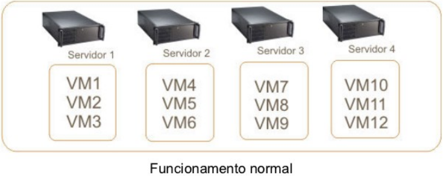
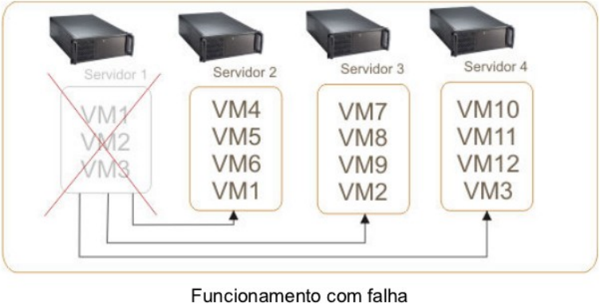
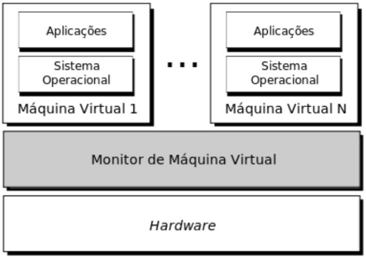
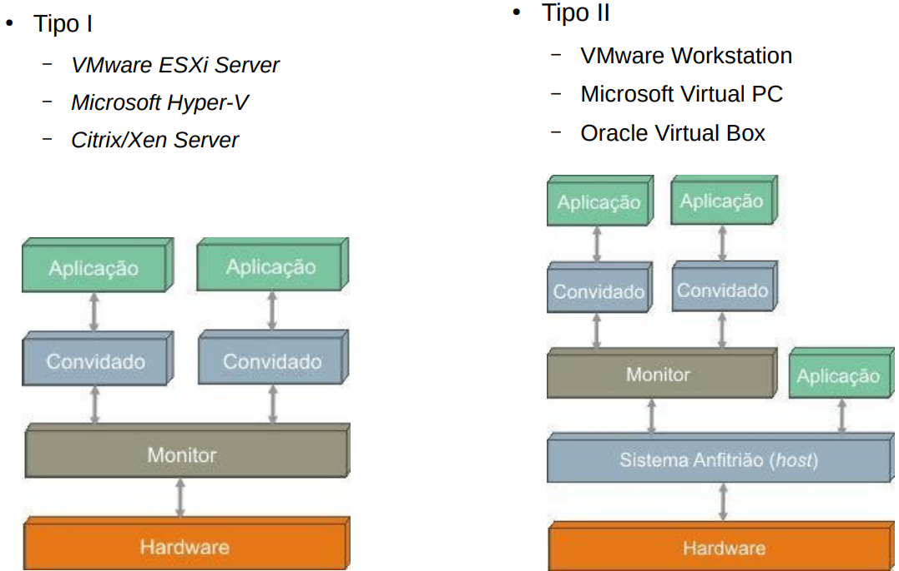
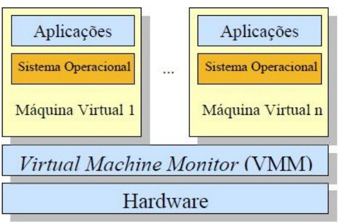

## Introdução - Por que virtualizar?

- Descentralização de recursos computacionais.
  - Cloud computing
- Plena utilização de recursos físicos.
  - "Do more with less"
  - Reaproveitamento de recursos
- Diferentes SOs no mesmo hardware.
  - Isolamento de aplicações
  - Segurança
- Redução no número de máquinas físicas.
  - Economia de energia, espaço, dinheiro

## Introdução - Por que virtualizar?

- Facilidade de gerenciamento.
- Treinamentos e ambientes de ensino.
- Facilidade para restauração e recuperação de serviços.
  - Maior disponibilidade
  - Tolerância a falhas

## Introdução - Por que virtualizar?

::: {layout-ncol=2}

:::

## Introdução - Contexto histórico

- Surgiu na década de 60 na IBM.
  - Soluções combinadas em hardware e software (desempenho!).
  - Dividir logicamente o mainframe.
- Recurso caro, necessário utilização completa.
- Popularização do x86 no final da década de 80.
  - Desktops
  - Virtualização ficou de lado
- Popularização da Internet a partir da década de 90.
  - Alta disponibilidade,
  - Necessidade de economia de recursos,
  - Virtualização ganha espaço novamente.

---

## Conceitos

- "Uma máquina virtual é uma cópia eficiente e isolada da máquina real" (POPEK; GOLDBERG, 1974).
- Uma Máquina Virtual é um ambiente de computação que opera como um sistema de computador completo, com seu próprio hardware virtual, porém, executado sobre um hardware físico existente.
- Em essência, é um computador dentro de outro computador.
- Existem duas categorias de máquinas virtuais:
  - Máquinas virtuais de processo (ex. JVM).
    - Execução de programas
  - Máquinas virtuais de sistemas (ex. Virtual Box).
    - Execução de SO completo

## Conceitos - MMV

- Monitor de Máquina Virtual (MMV) ou Virtual Monitor Machine (VMM)
  - Camada de software que abstrai os recursos físicos para utilização das máquinas virtuais,
  - Hipervisor ou Hypervisor.

## Conceitos - MMV

{fig-align="center" width="55%"}

## Conceitos - MMV {.smaller}

- Definições de Popek e Goldberg:
  - O MMV deve fornecer aos programas um ambiente idêntico ao da máquina original.
  - Os programas nesse ambiente devem apresentar como perda apenas uma diminuição de sua velocidade de execução.
  - O MMV deve possuir controle completo sobre os recursos do sistema.
- O MMV deve interpretar e emular o conjunto de instruções entre as máquinas virtuais e a máquina real.

## Conceitos - MMV {.smaller}

- Principais funções do MMV:
  - Definir o ambiente de máquinas virtuais.
  - Alterar o modo de execução do sistema operacional.
    - Kernel ⟷ User
  - Emular as instruções e escalonar CPU para as VMs
    - Muitas instruções do processador virtual devem ser executadas diretamente pelo processador real, sem que haja intervenção do monitor (eficiência!).
  - Gerenciar acesso a memória e disco.
  - Intermediar as chamadas de sistema e controlar acesso a outros dispositivos de I/O.
    - Drive USB, dispositivos de rede etc.

## Conceitos - Definições

- Abstração de Hardware:
  - A máquina virtual abstrai o hardware físico subjacente, fazendo com que o sistema operacional convidado "pense" que está interagindo diretamente com hardware físico dedicado.
- Isolamento:
  - Cada máquina virtual é isolada das outras VMs e do sistema operacional hospedeiro.
  - Isso significa que problemas em uma VM geralmente não afetam as outras ou o host.

---

## Benefícios - Otimização do Hardware

- Consolidação de Servidores:
  - Em vez de ter múltiplos servidores físicos para diferentes aplicações, é possível rodar diversas VMs em um único servidor físico potente, economizando espaço, energia e custos de hardware.
- Utilização Máxima de Recursos:
  - Garante que o hardware físico seja utilizado de forma mais eficiente, evitando ociosidade.

## Benefícios - Flexibilidade e Agilidade

- Provisionamento Rápido:
  - Criar e configurar uma nova VM é muito mais rápido do que adquirir, instalar e configurar um novo hardware físico.
- Portabilidade:
  - VMs podem ser facilmente movidas de um host físico para outro (migração), o que é crucial para balanceamento de carga, manutenção ou recuperação de desastres.
- Snapshots e Rollbacks:
  - É possível "fotografar" o estado de uma VM em um determinado momento (snapshot) e retornar a esse estado posteriormente, ideal para testes de software ou recuperação de erros.

## Benefícios - Segurança e Isolamento

- Ambientes de Teste e Desenvolvimento Seguros:
  - Desenvolvedores podem testar novas aplicações ou configurações em VMs isoladas sem o risco de afetar sistemas de produção.
- Segurança Aprimorada:
  - Se uma VM for comprometida por malware, o impacto é contido dentro daquela VM, sem se espalhar para o host ou outras VMs.

## Benefícios - Redução de Custos

- Menos Hardware:
  - Diminui a necessidade de comprar múltiplos servidores físicos.
- Menor Consumo de Energia:
  - Menos servidores físicos significam menor consumo de energia e refrigeração.
- Simplificação da Gerência:
  - Ferramentas de virtualização centralizam a gerência de múltiplos servidores.

## Benefícios - Compatibilidade e Legacy

- Execução de Sistemas Operacionais Legados:
  - Permite rodar sistemas operacionais antigos que não são compatíveis com hardware moderno, garantindo a continuidade de aplicações antigas essenciais.

---

## Desafios - Desafios e Considerações ao Trabalhar com VMs

- Gerenciamento da Complexidade:
  - Ambientes com muitas VMs podem se tornar complexos de gerenciar sem ferramentas adequadas.
- Gargalos de Desempenho:
  - I/O de Disco: O subsistema de disco é frequentemente o maior gargalo em ambientes virtualizados, especialmente com muitas VMs acessando o mesmo armazenamento.
  - Rede: A capacidade da rede física do host e a configuração das redes virtuais são cruciais.

## Desafios - Desafios e Considerações ao Trabalhar com VMs

- Licenciamento de Software:
  - O licenciamento de alguns softwares pode ser mais complexo ou caro em ambientes virtualizados.
- Segurança:
  - Embora o isolamento seja um benefício, vulnerabilidades no hipervisor ou configurações incorretas podem comprometer a segurança.
- Custo Inicial:
  - O investimento inicial em hardware potente e software de virtualização pode ser significativo, embora geralmente compense a longo prazo.

---

## Componentes - Componentes Virtuais {.smaller}

- Para que uma VM funcione como um computador completo, ela precisa de seus próprios componentes virtuais:
  - CPU Virtual (vCPU):
    - O hipervisor aloca "fatias" do tempo de processamento das CPUs físicas para as vCPUs das VMs.
    - É possível atribuir múltiplos núcleos e até processadores virtuais.
  - Memória Virtual (vRAM):
    - O hipervisor gerencia a alocação de memória RAM física para as VMs.
    - Técnicas como memory ballooning e deduplication podem ser usadas para otimizar o uso da memória.

## Componentes - Componentes Virtuais {.smaller}

- Para que uma VM funcione como um computador completo, ela precisa de seus próprios componentes virtuais:
  - Disco Virtual (vHDD):
    - O disco rígido de uma VM é, na verdade, um arquivo (ou conjunto de arquivos) no sistema de arquivos do host físico.
    - Existem diferentes formatos de disco virtual (VMDK, VHD, VDI, QCOW2) e tipos (thick provisioned, thin provisioned).
  - Placa de Rede Virtual (vNIC):
    - Permite que a VM se conecte à rede, seja por meio de uma ponte com a placa de rede física do host, por NAT ou por redes internas virtuais.
  - Controladores de Dispositivo Virtuais:
    - A VM possui controladores virtuais para diversos dispositivos, como adaptadores de barramento, controladores de vídeo, etc.

---

## Tipos de Máquinas Virtuais

- Máquinas virtuais clássicas ou de Tipo I
  - O monitor é implementado entre o hardware e os sistemas convidados.
  - Executa com a maior prioridade sobre os sistemas convidados.
  - Pode interceptar e emular todas as operações que acessam ou manipulam os recursos de hardware.
  - VMware ESXi Server, Microsoft Hyper-V, Citrix/Xen Server.

## Tipos de Máquinas Virtuais

- Máquinas virtuais Hospedadas ou de Tipo II
  - O monitor é implementado como um processo de um sistema operacional "real".
  - O monitor simula todas as operações que o sistema anfitrião controlaria.
  - VMware Workstation, Microsoft Virtual PC, Oracle Virtual Box.

## Tipos de Máquinas Virtuais

{fig-align="center" width="75%"}

## Tipos de Máquinas Virtuais - Virtualização Total

- Provê uma completa simulação da subcamada de hardware para os sistemas convidados.
  - Todos os SOs que são capazes de executar diretamente em um hardware também podem executar em uma máquina virtual.
    - Não há necessidade de modificações nos sistemas operacionais convidados.
- O Monitor roda em modo kernel (Tipo 1), e os sistemas convidados em modo usuário.
  - Todas as instruções são "testadas".
  - As instruções sensíveis (privilegiadas) são capturadas e emuladas na VM.

## Tipos de Máquinas Virtuais - Virtualização Total {.smaller}

- Instruções sensíveis
  - São aquelas que podem consultar ou alterar o status do processador.
- Instruções privilegiadas
  - Só podem ser executadas em modo kernel.
    - Geram trap quando executadas em modo usuário.
- Segundo Popek e Goldberg, uma máquina é virtualizável se:
  - Instruções sensíveis formarem um subconjunto de instruções privilegiadas.
- IBM/370 é virtualizável.

## Tipos de Máquinas Virtuais - Virtualização Total

{fig-align="center" width="55%"}

## Tipos de Máquinas Virtuais - Virtualização Total {.smaller}

- Desvantagens
  - O número de dispositivos (drivers) a serem suportados pelo Monitor é extremamente elevado.
  - Instruções executadas pelo SO visitante devem ser testadas pelo Monitor.
  - Ter que contornar alguns problemas gerados pela implementação dos SOs.
    - SOs foram projetados para serem executados como instância única nas máquinas físicas.
    - Ex: Paginação ⟶ Disputa SOs ⟶ queda de desempenho.

---

## Futuro - Tendências e o Futuro da Virtualização

- Contêineres (Docker, Kubernetes):
  - Embora não sejam VMs, os contêineres oferecem um nível diferente de abstração e isolamento e são frequentemente usados em conjunto com VMs em arquiteturas de nuvem.
  - VMs fornecem a infraestrutura para rodar contêineres.
- Virtualização de Funções de Rede (NFV):
  - Virtualização de funções de rede tradicionalmente implementadas em hardware dedicado (firewalls, roteadores, balanceadores de carga).

## Futuro - Tendências e o Futuro da Virtualização

- Edge Computing:
  - VMs em locais de borda para processamento de dados mais próximo da fonte.
- Serverless Computing:
  - Embora abstraia ainda mais a infraestrutura, VMs ainda são o substrato para muitas plataformas serverless.
- Inteligência Artificial e Machine Learning:
  - VMs com GPUs virtuais ou pass-through de GPU para cargas de trabalho de IA.

---

## Obrigado!

::: {.notes}
Fim da Aula 05 — conteúdo fiel ao material de referência do professor anterior (PDF de 30 slides), com autoria atualizada.
:::
