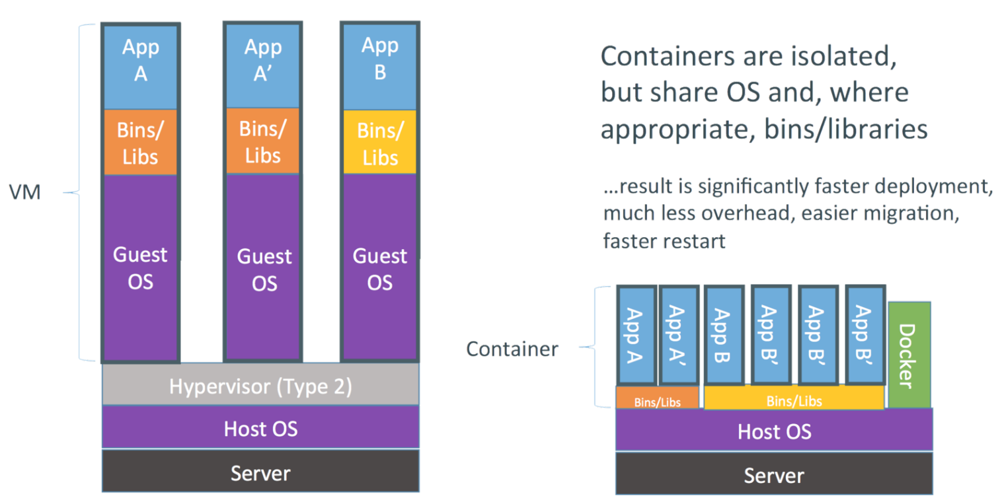
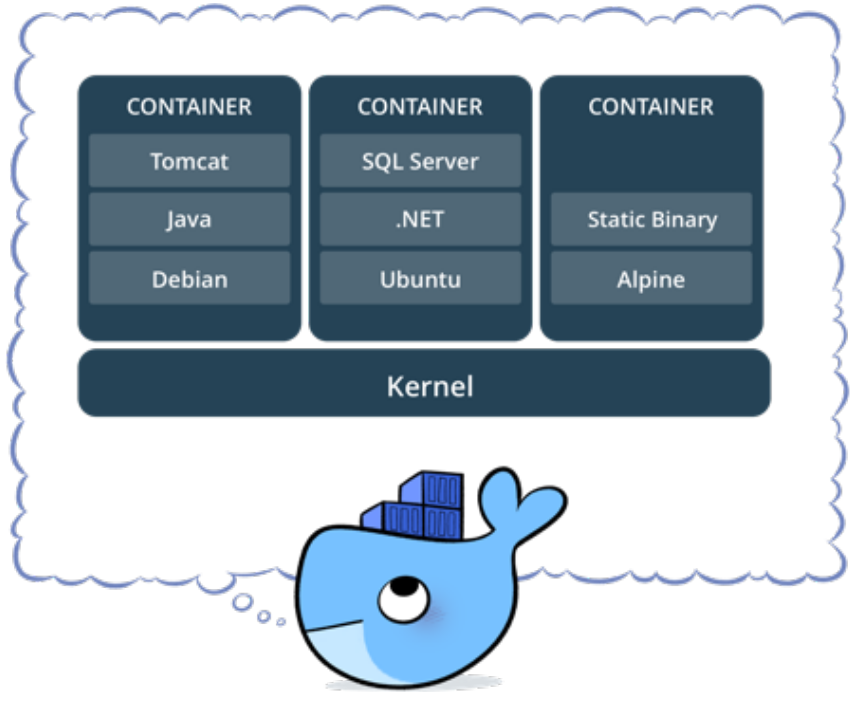
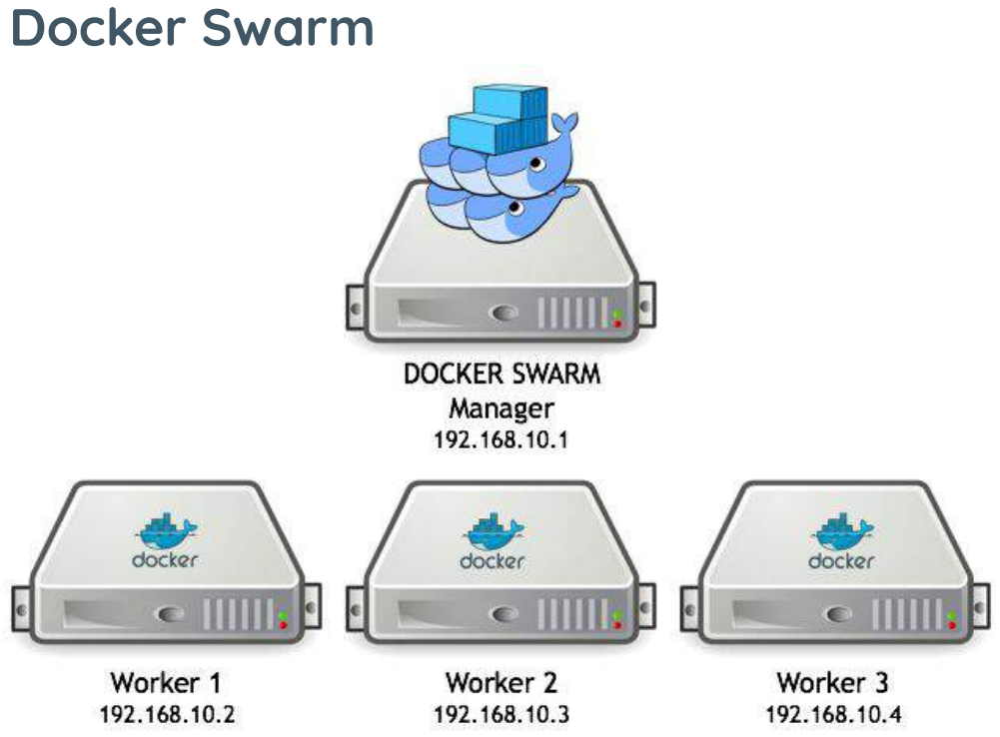

## Introdução - Docker

- É uma ferramenta que se apoia em recursos existentes no kernel, inicialmente Linux, para isolar a execução de processos.
- As ferramentas que o Docker traz são basicamente uma camada de administração de containers, baseado originalmente no LXC.
- O Docker é uma plataforma de código aberto que permite aos desenvolvedores construir, implementar, executar, atualizar e gerenciar containers.

## Introdução - Docker

- A palavra "Docker" possui várias definições:
  - um projeto da comunidade open source;
  - as ferramentas resultantes desse projeto;
  - a empresa Docker Inc., principal apoiadora do projeto;
  - e as ferramentas compatíveis formalmente com a empresa.
- O fato da empresa e das tecnologias terem o mesmo nome pode causar alguma confusão.

## Introdução - Docker

- O software de TI "Docker" é uma tecnologia de conteinerização para criação e uso de containers Linux.
- A comunidade open source do Docker trabalha gratuitamente para melhorar essas tecnologias para todos os usuários.
- A empresa Docker Inc. se baseia no trabalho realizado pela comunidade do Docker, tornando-o mais seguro, e compartilha os avanços com a comunidade em geral.
- Depois, ela oferece aos clientes empresariais o suporte necessário para as tecnologias, que foram aprimoradas e fortalecidas.

## Introdução - Docker

- Com o Docker, é possível lidar com os containers como se fossem máquinas virtuais modulares e extremamente lightweight.
- Além disso, os containers oferecem maior flexibilidade para você criar, implantar, copiar e migrar um container de um ambiente para outro.

## Introdução - Docker - Como funciona

- A tecnologia Docker usa o kernel do Linux e funcionalidades do kernel, como cGroups e namespaces, para segregar processos.
- Assim, eles podem ser executados de maneira independente.
- O objetivo dos containers é criar independência:
  - a habilidade de executar diversos processos e apps separadamente para utilizar melhor a infraestrutura e,
  - ao mesmo tempo, manter a segurança que você teria em sistemas separados.

## Introdução - Docker - Como funciona

- As ferramentas de container, incluindo o Docker, incluem um modelo de implantação com base em imagem.
- Isso facilita o compartilhamento de uma aplicação ou conjunto de serviços, incluindo todas as dependências deles em vários ambientes.
- O Docker também automatiza a implantação da aplicação (ou de conjuntos de processos que constituem uma app) dentro desse ambiente de containers.

---

## Containers

- Contêineres são unidades executáveis de software que empacotam o código da aplicação juntamente com suas bibliotecas e dependências.
- Eles permitem que o código seja executado em qualquer ambiente de computação, seja desktop, TI tradicional ou infraestrutura de nuvem.
- Os contêineres aproveitam uma forma de virtualização do sistema operacional (SO) na qual os recursos do kernel do SO podem ser usados para isolar processos e controlar a quantidade de CPU, memória e disco que esses processos podem acessar.

## Containers

- Mais portáteis e eficientes em termos de recursos do que as máquinas virtuais (VMs), os contêineres se tornaram as unidades de computação de fato de aplicações nativas da nuvem modernas.
- Uma forma de entender melhor um contêiner é examinar como ele difere de uma máquina virtual (VM) tradicional,
- Uma VM é geralmente chamada de "convidado", enquanto a máquina física em que ela é executada é chamada de "hospedeira".

## Containers

- Em vez de virtualizar o hardware subjacente, a tecnologia de contêiner virtualiza o SO para que cada contêiner contenha somente a aplicação e suas bibliotecas, arquivos de configuração e dependências.
- A ausência do sistema operacional convidado é o motivo pelo qual os contêineres são tão leves e, portanto, mais rápidos e mais portáteis do que as máquinas virtuais.
- Contêineres e máquinas virtuais não são mutuamente exclusivos.
  - Ex: uma organização pode aproveitar as duas tecnologias executando contêineres nas VMs para aumentar o isolamento e a segurança e aproveitar as ferramentas já instaladas para automação, backup e monitoramento.

## Containers - Benefícios

- A principal vantagem dos contêineres, especialmente em comparação com uma VM, é que eles fornecem um nível de abstração que os torna leves e portáteis.
- Seus principais benefícios incluem:
  - Leve:
    - Os contêineres compartilham o kernel do sistema operacional da máquina.
    - O tamanho menor de um contêiner significa que ele pode ser executado rapidamente e oferecer melhor suporte a aplicações nativas da nuvem que escalam horizontalmente.

## Containers - Benefícios

- Seus principais benefícios incluem:
  - Portátil e independente de plataforma
    - Os contêineres carregam todas as suas dependências com eles, o que significa que o software pode ser escrito uma única vez e depois executado sem precisar ser reconfigurado em ambientes de computação.
  - Compatíveis com desenvolvimento e arquitetura modernos
    - Os contêineres são ideais para padrões de desenvolvimento e aplicações modernos, como DevOps, serverless e microsserviços.

---

## Docker

- Definição oficial
  - Containers Docker empacotam componentes de software em um sistema de arquivos completo, que contêm tudo necessário para a execução: código, runtime, ferramentas de sistema - qualquer coisa que possa ser instalada em um servidor.
  - Isto garante que o software sempre irá executar da mesma forma, independente do seu ambiente.

{fig-align="center" width="30%"}

## Docker

- O Docker tende a utilizar menos recursos que uma VM tradicional, um dos motivos é não precisar de uma pilha completa como vemos em Comparação VMs x Containers.
- O Docker utiliza o mesmo kernel do host, e ainda pode compartilhar bibliotecas.
- Mesmo utilizando o mesmo kernel é possível utilizar outra distribuição com versões diferentes das bibliotecas e aplicativos.

## Docker

{fig-align="center" width="80%"}

## Docker

- Devo trocar então minha VM por um container?
  - Nem sempre, os containers Docker possuem algumas limitações em relação as VMs:
- Limitações:
  - Todas as imagens são linux, apesar do host poder ser qualquer SO que use ou emule um kernel linux, as imagens em si serão baseadas em linux.
  - Não é possível usar um kernel diferente do host, o Docker Engine estará executando sob uma determinada versão (ou emulação) do kernel linux, e não é possível executar uma versão diferente, pois as imagens não possuem kernel.

## Docker - Container

- Container é o nome dado para a segregação de processos no mesmo kernel, de forma que o processo seja isolado o máximo possível de todo o resto do ambiente.
- Em termos práticos são File Systems, criados a partir de uma "imagem" e que podem possuir também algumas características próprias.

## Docker - Container

{fig-align="center" width="60%"}

## Docker - Imagens Docker

- Uma imagem Docker é a materialização de um modelo de um sistema de arquivos, modelo este produzido através de um processo chamado build.
- Esta imagem é representada por um ou mais arquivos e pode ser armazenada em um repositório.
- Docker File Systems
  - O Docker utiliza file systems especiais para otimizar o uso, transferência e armazenamento das imagens, containers e volumes.
  - O principal é o AUFS, que armazena os dados em camadas sobrepostas, e somente a camada mais recente é gravável.

## Docker - Tecnologias

- Docker Compose:
  - Uma ferramenta para definir e executar aplicativos Docker a partir de vários contêineres.
- Docker Hub:
  - Um repositório com mais de 250 mil imagens diferentes para os seus containers.
- Docker Swarm:
  - Ferramenta nativa de orquestração do docker.
  - Permite que containers executem distribuídos em em um cluster, controlando a quantidade de containers, registro, deploy e update de serviços.

## Docker - Tecnologias

{fig-align="center" width="55%"}

## Docker - Arquitetura

- O Docker usa uma arquitetura cliente/servidor.
- A seguir encontra-se um detalhamento dos principais componentes associados ao Docker, juntamente com com outros termos e ferramentas do Docker.
- Host do Docker:
  - É uma máquina física ou virtual que executa o sistema operacional compatível.
- Docker Engine:
  - É a aplicação cliente/servidor que consiste no daemon do Docker, uma API do Docker que interage com o daemon e uma interface de linha de comando (CLI) que se comunica com o daemon.

## Docker - Arquitetura

- Daemon do Docker:
  - É um serviço que cria e gerencia imagens do Docker usando os comandos do cliente.
  - Essencialmente, serve como o centro de controle para a implementação do Docker.
- Cliente do Docker:
  - Fornece a CLI que acessa a API do Docker (uma API REST) para se comunicar com o daemon do Docker por meio de soquetes Unix ou de uma interface de rede.
  - Pode ser conectado a um daemon remotamente, ou um desenvolvedor pode executar o daemon e o cliente no mesmo sistema de computador.

## Docker - Arquitetura

- Objetos do Docker:
  - São componentes de uma implementação do Docker que ajudam a empacotar e distribuir aplicações.
  - Eles incluem imagens, contêineres, redes, volumes, plug-ins e muito mais.
- Contêineres do Docker:
  - São instâncias ativas e em execução de imagens do Docker.
  - Enquanto as imagens do Docker são arquivos somente leitura, os contêineres são conteúdos executáveis e efêmeros.
  - Os usuários podem interagir com eles, e os administradores podem ajustar suas configurações e condições usando comandos do Docker.

## Docker - Arquitetura

- Imagens do Docker:
  - Contêm código fonte executável da aplicação e todas as ferramentas, bibliotecas e dependências de que o código da aplicação precisa para ser executado como um contêiner.
  - Quando um desenvolvedor executa a imagem do Docker, ela se torna uma instância (ou várias instâncias) do contêiner.
  - É possível criar imagens do Docker do zero, mas a maioria dos desenvolvedores as extrai de repositórios comuns.
  - Os desenvolvedores podem criar várias imagens do Docker a partir de uma única imagem de base e compartilharão os pontos em comum de sua stack.

## Docker - Arquitetura

- Imagens do Docker:
  - As imagens do Docker são compostas por camadas, e cada camada corresponde a uma versão da imagem.
  - Sempre que um desenvolvedor faz alterações na imagem, uma nova camada superior é criada, substituindo a camada superior anterior como a versão atual da imagem.
  - Camadas anteriores são salvas para reversões ou para serem reutilizadas em outros projetos.
  - Cada vez que um contêiner é criado a partir de uma imagem do Docker, outra nova camada é criada.
  - As alterações feitas no contêiner, como adicionar ou excluir arquivos, são salvas na camada do contêiner, e essas alterações só existem enquanto o contêiner está em execução.

## Docker - Arquitetura

- Docker build:
  - É um comando que possui ferramentas e recursos para criar imagens do Docker.
- Dockerfile:
  - Todo contêiner do Docker começa com um arquivo de texto simples contendo instruções sobre como construir a imagem do contêiner do Docker.
  - O Dockerfile automatiza o processo de criação de imagens do Docker.
  - É essencialmente uma lista de instruções CLI que o Docker Engine executará para montar a imagem.

## Docker - Arquitetura

- Documentação do Docker:
  - Refere-se à biblioteca oficial de recursos, manuais e guias do Docker para criar aplicações conteinerizadas.
- Docker Hub:
  - É o repositório público de imagens do Docker, que se autodenomina a maior biblioteca do mundo para imagens de contêineres.
  - Ele contém mais de 100.000 imagens de contêineres provenientes de fornecedores de software comerciais, projetos de código aberto e desenvolvedores individuais.
  - O Docker Hub inclui imagens produzidas pela Docker, Inc., imagens certificadas pertencentes ao Docker Trusted Registry e milhares de outras imagens.

## Docker - Arquitetura

- Docker Desktop:
  - É uma aplicação para Mac ou Windows que inclui o Docker Engine, cliente Docker CLI, Docker Compose, Kubernetes e outros.
  - Ele também fornece acesso ao Docker Hub.
- Registro do Docker:
  - É um sistema de armazenamento e distribuição escalável e de código aberto para imagens do Docker.
  - Ele permite que os desenvolvedores rastreiem versões de imagens em repositórios usando marcação para identificação.
  - Esse rastreamento e identificação são realizados usando o Git, uma ferramenta de controle de versões.

## Docker - Arquitetura

- Plug-ins do Docker:
  - Os desenvolvedores usam plug-ins para tornar o Docker Engine ainda mais funcional.
  - Vários plug-ins do Docker compatíveis com autorização, volume e rede estão incluídos no sistema de plug-in do Docker Engine; plug-ins de terceiros também podem ser carregados.
- Extensões do Docker:
  - Permitem que os desenvolvedores usem ferramentas de terceiros no Docker Desktop para estender suas funções.
  - As extensões para developer tools incluem desenvolvimento de aplicativos Kubernetes, segurança, observabilidade e muito mais.

## Docker - Arquitetura

- Docker Compose:
  - Os desenvolvedores podem usar o Docker Compose para gerenciar aplicações multicontêineres, onde todos os contêineres são executados no mesmo host do Docker.
  - O Docker Compose cria um arquivo YAML (.YML) que especifica quais serviços estão incluídos na aplicação e pode implementar e executar contêineres com um único comando.
  - Como a sintaxe YAML é indiferente em relação à linguagem, arquivos YAML podem ser usados em programas desenvolvidos em Java, Python, Ruby e muitas outras linguagens.
  - Os desenvolvedores também podem utilizar o Docker Compose para definir volumes persistentes para armazenamento, especificar nós base e documentar e configurar dependências de serviços.

---

## Obrigado!

::: {.notes}
Fim da Aula 09 — conteúdo fiel ao material de referência do professor anterior (PDF de 32 slides), com autoria atualizada.
:::
