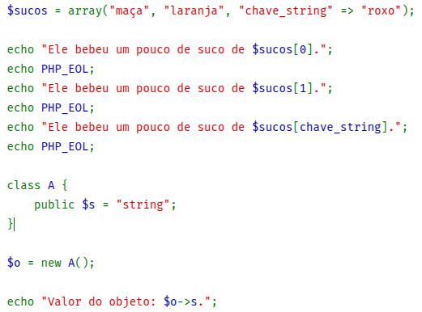

## Introdução - Docker Playground

- O Docker Playground (também conhecido como Play with Docker ou Docker Labs) é uma plataforma gratuita e online da Docker que permite aprender e experimentar a tecnologia de contêineres sem a necessidade de instalar o Docker localmente.
- Ele oferece um ambiente seguro para criar instâncias, testar comandos do Docker, construir aplicações e até mesmo criar e gerenciar clusters Docker Swarm.
- A plataforma é acessada via navegador, é baseada em Alpine Linux, e as sessões de teste duram cerca de 2 horas, com todo o ambiente sendo removido ao final.

## Introdução - Docker Playground - Acesso

- Acesso:
  - É preciso ter uma conta Docker para aceder ao ambiente.
- Criação de ambiente:
  - Ao iniciar uma sessão, o ambiente de laboratório é preparado, permitindo a criação de instâncias que são, essencialmente, contêineres dentro de contêineres.

## Introdução - Docker Playground - Experimentação

- Experimentação:
  - Possibilidade de executar comandos do Docker, adicionar múltiplas instâncias para criar clusters Docker Swarm, testar configurações e interagir com as instâncias.
- Duração e expiração:
  - Cada sessão possui uma duração limitada, tipicamente 2 horas, após as quais o ambiente e todas as instâncias são removidos.

## Introdução - Docker Playground - Principais benefícios

- Aprendizagem interativa:
  - Permite aprender a tecnologia Docker de forma prática e envolvente.
- Acessibilidade:
  - Não é necessário instalar qualquer software no computador local, podendo ser acedido de qualquer dispositivo através do navegador.
- Ambiente seguro:
  - Funciona como um sandbox seguro para testar ideias e comandos sem afetar o sistema local.
- Teste de clusters:
  - É possível criar e gerir clusters Docker Swarm, o que é útil para entender a orquestração de contêineres.

## Introdução - Docker Playground - Principais benefícios

- Docker Playground
  - `https://labs.play-with-docker.com/`

---

## Exemplo - Utilizando Contêiner MySql

- Acesse o site da Docker Playground (Slide anterior).
- Faça Login.
- Clique em "Start" ou "Start a session" para iniciar um novo ambiente.
- Isso provisionará uma máquina virtual com o Docker pré-instalado e um terminal à sua disposição.

## Exemplo - Utilizando Contêiner MySql

- Rodar o contêiner do MySQL
  - No terminal da Docker Playground, execute o seguinte comando para iniciar um contêiner do MySQL.
  - `docker run --name mysql-db -e MYSQL_ROOT_PASSWORD=my-secret-pw -d mysql:5.7`

## Exemplo - Utilizando Contêiner MySql

- O comando
  - **docker run**: Comando para criar e iniciar um novo contêiner.
  - **--name mysql-db**: Atribui um nome para o contêiner. Isso facilita a identificação e a conexão.
  - **-e MYSQL_ROOT_PASSWORD=my-secret-pw**: Define uma variável de ambiente. Neste caso, estamos configurando a senha de root para o banco de dados.
  - **-d**: Roda o contêiner em segundo plano.
  - **mysql:5.7**: Especifica a imagem do Docker a ser usada. Estamos utilizando a versão 5.7 do MySQL.

## Exemplo - Utilizando Contêiner MySql

- Verificar o status do contêiner
  - Para confirmar se o contêiner está rodando, execute o seguinte comando:
  - **docker ps**
  - Resultado: Uma lista de todos os contêineres em execução. O seu contêiner "mysql-db" deverá aparecer na lista, com o status Up... (rodando há alguns segundos).

## Exemplo - Utilizando Contêiner MySql

- Acessar o terminal do contêiner do MySQL
  - Para interagir com o banco de dados, você precisa acessar o terminal do contêiner. Execute o comando a seguir:
  - **docker exec -it mysql-db bash**
  - O comando:
    - **docker exec**: Comando para executar um comando dentro de um contêiner em execução.
    - **-it**: Permitem que você interaja com o terminal do contêiner.
    - **mysql-db**: O nome do contêiner que queremos acessar.
    - **bash**: O comando que queremos executar dentro do contêiner para abrir um terminal do tipo Bash.

## Exemplo - Utilizando Contêiner MySql

- Conectar-se ao MySQL e criar um banco de dados
  - Agora que você está dentro do contêiner, use o cliente MySQL para se conectar ao banco de dados:
  - **mysql -u root -p**
  - O terminal pedirá a senha. Digite a senha que você definiu no início, que é my-secret-pw.
  - Se a conexão for bem-sucedida, o prompt do terminal mudará para mysql>. Você pode agora executar comandos SQL.

## Exemplo - Utilizando Contêiner MySql

- Restantes dos comandos em sala....

---

## Exemplo 2 - Utilizando Contêiner Python

- Criar o contêiner Python
- Baixe uma imagem Python do Docer Hub
  - **docker pull python:3**

## Exemplo 2 - Utilizando Contêiner Python

- Rodar o conteiner Python
- **docker run -it python:3 bash**

## Exemplo 2 - Utilizando Contêiner Python

- Rodar o conteiner Python
  - **docker run -it python:3 bash**
- Execute o Python no bash
  - **python**

## Exemplo 2 - Utilizando Contêiner Python

- Uma imagem semelhante a imagem abaixo irá aparecer.

```
root@5bc9e16b4723:/# python
Python 3.13.7 (main, Aug 15 2025, 22:13:02) [GCC 14.2.0] on linux
Type "help", "copyright", "credits" or "license" for more information.
>>>
```

## Exemplo 2 - Utilizando Contêiner Python

- Agora só executar comandos python.
  - **print("Hello from Docker Playground!")**
- ou executar um arquivo com programação python.
  - **python script.py**

---

## Docker Playground - Atividade

- Faça um passo a passo com prints dos itens abaixo:
  - No site do Docker Playground
  - Crie uma instancia com o seu nome.
  - Nesta instância faça o passo a passo com imagens de como instalar e rodar um código php a seguir.

## Docker Playground - Atividade

- Mostre o print de cada parte executada inclusive do resultado do conteúdo depois de ser executado.

{fig-align="center" width="55%"}

---

## Obrigado!

::: {.notes}
Fim da Aula 10 — conteúdo fiel ao material de referência do professor anterior (PDF de 21 slides), com autoria atualizada.
:::
