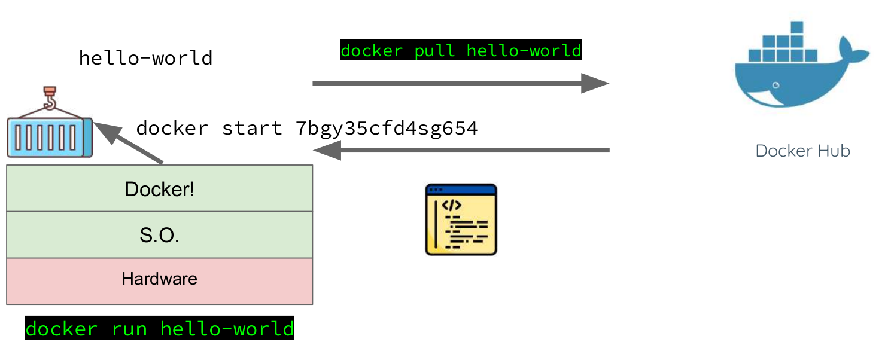

## Introdução

- Outras definições
  - **Imagem**: pacote com todas as dependências e informações necessárias para criar um contêiner.
  - **Dockerfile**: arquivo de texto que contém instruções sobre como criar uma imagem.
  - **Build**: Ação de criação de uma imagem.
  - **Contêiner**: Instância de uma imagem do Docker.
  - **Volume**: Oferece um sistema de arquivos gravável que pode ser usado pelo contêiner.

## Introdução

- Outras definições
  - Tag: rótulo que pode ser aplicado a imagens, de modo que as diferentes imagens ou versões da mesma imagem possam ser identificadas.
  - Repositório: coleção de imagens relacionadas, rotuladas com uma tag que indica a versão da imagem.
  - Registro: Serviço que fornece acesso aos repositórios.
    - O registro padrão para as imagens públicas é o Docker Hub.
    - Um registro geralmente contém repositórios de várias equipes.
    - As empresas geralmente têm registros privados para armazenar e gerenciar as imagens que criaram.

---

## Comandos - Outros Comandos

- Outros comandos Docker para utilizar no Docker Playground
- Abra o Docker Playground Link Aqui
- Mais alguns exemplos de códigos:
  - Adicione mais uma instância
  - Comando: docker version
  - Comando: docker run php
  - O que aconteceu??

## Comandos - Outros Comandos

- Ao executar esse comando (docker run), o Docker:
  - Verifica se temos a imagem localmente.
  - Caso contrário, busca e faz o download no Docker Store!
- A imagem do Docker é, basicamente, uma série de instruções que o Docker seguirá para criar um contêiner.
- Em seguida, com o contêiner criado, o Docker irá executá-lo.

## Comandos - Diferença

{fig-align="center" width="75%"}

## Comandos - Outros Comandos

- Execute os comandos abaixo:
  - docker run alpine
  - docker run ubuntu
  - docker run debian
  - docker images

## Comandos - Outros Comandos

- Comando: docker ps
  - Utilizado para verificar quais os contêineres que estão sendo executados.
  - Quando um contêiner não está sendo executado, ele fica parado (stopped)!
- Para verificarmos todos os contêineres (parados e em execução), utilizamos a flag -a.
  - docker ps -a

## Comandos - Outros Comandos

- Para que o contêiner criado realize alguma atividade, precisamos informar junto do comando de execução o que ele deverá fazer.
  - docker run alpine echo "Ola Mundo"

## Comandos - Outros Comandos

- O comando run aceita a informação de qual versão de uma determinada imagem gostaríamos de utilizar.
- Para isso, basta informarmos através de uma tag.
- Se nenhuma tag for informada, o Docker irá utilizar sempre a versão latest.
  - docker run ubuntu:18.04 cat /etc/issue

## Comandos - Outros Comandos

- Da mesma forma que podemos instanciar e executar um comando dentro de um contêiner, podemos pará-lo.
  - docker stop "contêiner ID"
  - docker stop 3hg567caz645

## Comandos - Outros Comandos

- Pergunta: o comando run sempre cria novos contêineres?

## Comandos - Outros Comandos

- Caso queiramos executar comandos adicionais em um contêiner que já está em execução, podemos utilizar o comando exec.
  - docker exec [opções] \<contêiner\> \<comando\> [argumentos...]

## Comandos - Outros Comandos

- **[opções]**: Flags que modificam o comportamento do comando.
- **\<contêiner\>**: O identificador do contêiner onde o comando será executado. Usar nomes (--name) é sempre mais prático.
- **\<comando\>**: O programa ou script que você quer rodar dentro do contêiner (ex: bash, ls, psql).
- **[argumentos...]**: Argumentos para o comando que você está executando (ex: ls -l /app).

## Comandos - Outros Comandos

- Flags
  - **-i** ou **--interactive**: Mantém a entrada padrão aberta.
    - O comando que você executar poderá receber input do seu terminal.
  - **-t** ou **--tty**: Aloca uma "pseudo-TTY" ou, um terminal.
    - Conecta o seu terminal ao terminal do contêiner.
  - **-it**: A combinação para obter um shell interativo dentro do contêiner.
    - Você está dizendo ao Docker: "Quero executar um comando interativo e quero um terminal para fazer isso".

## Comandos - Outros Comandos

- Flags
  - **-d** ou **--detach**: Executa o comando em segundo plano.
    - O comando é iniciado dentro do contêiner, mas o seu terminal é liberado imediatamente. Útil para iniciar processos longos.
  - **-u** ou **--user**: Permite especificar o nome de usuário com o qual o comando será executado dentro do contêiner. Útil para testar permissões.
  - **-w** ou **--workdir**: Define o diretório de trabalho onde o comando será executado dentro do contêiner.
    - Exemplo: docker exec -w /app/migrations ...

## Comandos - Atividade Prática

1. Contêiner 1
   1. Crie um contêiner CentOS.
   2. Execute o comando sleep e suspenda o SO por 2000 segundos.
   3. Verifique os contêineres em execução.
   4. Pare o contêiner que está executando o comando sleep.

## Comandos - Atividade Prática

2. Contêiner 2
   1. Crie um contêiner Ubuntu no modo iterativo,
   2. Crie um arquivo de texto dentro do contêiner com o comando touch
   3. Saia do contêiner
   4. Utilize o comando run novamente para tentar "acessar" o contêiner passado
   5. Busque pelo arquivo criado anteriormente com o comando ls

---

## Obrigado!

::: {.notes}
Fim da Aula 11 — conteúdo fiel ao material de referência do professor anterior (PDF de 19 slides), com autoria atualizada.
:::
